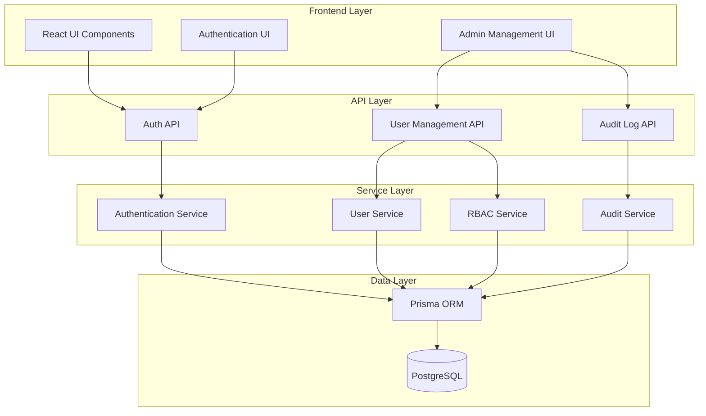

# Design Document: Admin Account System

## Overview

本设计文档描述管理员账号系统的技术实现方案。该系统将在现有的用户认证基础上引入基于角色的访问控制（RBAC），区分管理员和普通用户，并提供完整的用户管理功能。

### 核心目标

1. 实现基于角色的访问控制（RBAC）
2. 移除公开注册功能，仅允许管理员创建用户
3. 提供完整的用户管理界面（CRUD操作）
4. 实现临时密码机制和强制密码修改流程
5. 记录所有管理操作的审计日志
6. 从演示账号平滑迁移到真实管理员账号体系

### 技术栈

- **后端**: Node.js + TypeScript + Vercel Serverless Functions
- **数据库**: PostgreSQL + Prisma ORM
- **认证**: JWT (JSON Web Tokens) + bcryptjs
- **前端**: React + TypeScript + Vite
- **测试**: Vitest + fast-check (property-based testing)

## Architecture

### 系统架构图



### 架构层次说明

1. **Frontend Layer**: React组件层，包含用户界面和管理界面
2. **API Layer**: Vercel Serverless Functions，处理HTTP请求
3. **Service Layer**: 业务逻辑层，封装核心功能
4. **Data Layer**: 数据持久化层，使用Prisma ORM访问PostgreSQL

### 关键设计决策

1. **角色存储方式**: 在User表中添加role字段（enum类型），而非单独的角色表。理由：系统只有两个固定角色，不需要复杂的角色管理。

2. **JWT Payload扩展**: 在JWT token中包含role信息，避免每次请求都查询数据库。理由：提高性能，减少数据库查询。

3. **临时密码标记**: 使用User表中的requirePasswordChange布尔字段标记临时密码状态。理由：简单直接，易于实现和维护。

4. **审计日志独立表**: 创建独立的AuditLog表存储所有管理操作。理由：便于查询、分析和长期保存。

5. **软删除vs硬删除**: 用户删除采用硬删除，但在审计日志中保留记录。理由：符合数据最小化原则，同时保留操作历史。

## Components and Interfaces

### 后端组件

#### 1. Authentication Service (lib/auth.ts)

扩展现有的认证服务，添加角色支持。

```typescript
// 扩展JWT payload
interface JWTPayload {
  userId: string
  role: UserRole
}

// 扩展AuthRequest接口
interface AuthRequest extends VercelRequest {
  userId?: string
  userRole?: UserRole
}

// 新增角色验证中间件
function withRole(
  requiredRole: UserRole,
  req: AuthRequest,
  res: VercelResponse,
  next: () => void | Promise<void>
): void

// 更新token生成函数
function generateToken(userId: string, role: UserRole): string
```

#### 2. User Management API (api/user/manage.ts)

新建用户管理API端点。

```typescript
// POST /api/user/manage/create - 创建用户（仅管理员）
interface CreateUserRequest {
  email: string
  name: string
  role: UserRole
}

interface CreateUserResponse {
  user: UserData
  temporaryPassword: string
}

// GET /api/user/manage/list - 获取用户列表（仅管理员）
interface ListUsersRequest {
  page?: number
  limit?: number
}

interface ListUsersResponse {
  users: UserData[]
  total: number
  page: number
  limit: number
}

// PUT /api/user/manage/:userId - 更新用户（仅管理员）
interface UpdateUserRequest {
  name?: string
  role?: UserRole
  resetPassword?: boolean
}

interface UpdateUserResponse {
  user: UserData
  temporaryPassword?: string
}

// DELETE /api/user/manage/:userId - 删除用户（仅管理员）
interface DeleteUserResponse {
  success: boolean
  message: string
}
```

#### 3. Password Management API (api/user/password.ts)

新建密码管理API端点。

```typescript
// POST /api/user/password/change - 修改密码
interface ChangePasswordRequest {
  currentPassword: string
  newPassword: string
}

// POST /api/user/password/force-change - 强制修改临时密码
interface ForceChangePasswordRequest {
  temporaryPassword: string
  newPassword: string
}
```

#### 4. Audit Log API (api/audit/logs.ts)

新建审计日志API端点。

```typescript
// GET /api/audit/logs - 获取审计日志（仅管理员）
interface GetAuditLogsRequest {
  page?: number
  limit?: number
  action?: AuditAction
  startDate?: string
  endDate?: string
}

interface GetAuditLogsResponse {
  logs: AuditLogData[]
  total: number
  page: number
  limit: number
}
```

### 前端组件

#### 1. Admin Dashboard (app/src/pages/AdminDashboard.tsx)

管理员主控制面板。

```typescript
interface AdminDashboardProps {}

// 功能：
// - 显示用户统计信息
// - 快速访问用户管理功能
// - 显示最近的审计日志
```

#### 2. User Management Table (app/src/components/admin/UserManagementTable.tsx)

用户列表和管理组件。

```typescript
interface UserManagementTableProps {
  onCreateUser: () => void
  onEditUser: (userId: string) => void
  onDeleteUser: (userId: string) => void
}

// 功能：
// - 显示用户列表（分页）
// - 搜索和过滤用户
// - 快速操作按钮（编辑、删除）
```

#### 3. Create User Modal (app/src/components/admin/CreateUserModal.tsx)

创建用户对话框。

```typescript
interface CreateUserModalProps {
  isOpen: boolean
  onClose: () => void
  onSuccess: (user: UserData, tempPassword: string) => void
}

// 功能：
// - 输入邮箱、姓名、角色
// - 表单验证
// - 显示生成的临时密码
```

#### 4. Edit User Modal (app/src/components/admin/EditUserModal.tsx)

编辑用户对话框。

```typescript
interface EditUserModalProps {
  userId: string
  isOpen: boolean
  onClose: () => void
  onSuccess: () => void
}

// 功能：
// - 修改用户姓名
// - 修改用户角色
// - 重置密码
```

#### 5. Force Password Change (app/src/components/auth/ForcePasswordChange.tsx)

强制修改密码组件。

```typescript
interface ForcePasswordChangeProps {
  onSuccess: () => void
}

// 功能：
// - 检测requirePasswordChange标记
// - 强制用户修改临时密码
// - 阻止访问其他功能直到密码修改完成
```

#### 6. Audit Log Viewer (app/src/components/admin/AuditLogViewer.tsx)

审计日志查看器。

```typescript
interface AuditLogViewerProps {
  filters?: AuditLogFilters
}

// 功能：
// - 显示审计日志列表
// - 过滤和搜索
// - 导出日志
```

## Data Models

### 数据库Schema变更

#### 1. User表扩展

```prisma
enum UserRole {
  ADMIN
  USER
}

model User {
  id                    String   @id @default(cuid())
  email                 String   @unique
  name                  String
  password              String
  role                  UserRole @default(USER)
  requirePasswordChange Boolean  @default(false)
  createdAt             DateTime @default(now())
  updatedAt             DateTime @updatedAt

  // Relations
  assets              Asset[]
  likes               Like[]
  favorites           Favorite[]
  folders             Folder[]
  auditLogsPerformed  AuditLog[] @relation("PerformedBy")
  auditLogsTargeted   AuditLog[] @relation("TargetUser")

  @@map("users")
}
```

**新增字段说明**:
- `role`: 用户角色，枚举类型（ADMIN或USER）
- `requirePasswordChange`: 标记是否需要修改密码（用于临时密码）

#### 2. AuditLog表（新建）

```prisma
enum AuditAction {
  USER_CREATED
  USER_UPDATED
  USER_DELETED
  USER_ROLE_CHANGED
  PASSWORD_RESET
  PASSWORD_CHANGED
}

model AuditLog {
  id            String      @id @default(cuid())
  action        AuditAction
  performedById String
  targetUserId  String?
  details       Json?
  ipAddress     String?
  userAgent     String?
  createdAt     DateTime    @default(now())

  // Relations
  performedBy User  @relation("PerformedBy", fields: [performedById], references: [id], onDelete: Cascade)
  targetUser  User? @relation("TargetUser", fields: [targetUserId], references: [id], onDelete: SetNull)

  // Indexes
  @@index([performedById])
  @@index([targetUserId])
  @@index([action])
  @@index([createdAt])
  @@map("audit_logs")
}
```

**字段说明**:
- `action`: 操作类型（枚举）
- `performedById`: 执行操作的管理员ID
- `targetUserId`: 被操作的用户ID（可选）
- `details`: JSON格式的详细信息（如修改前后的值）
- `ipAddress`: 操作来源IP地址
- `userAgent`: 操作来源浏览器信息
- `createdAt`: 操作时间

### 数据迁移策略

#### Migration 1: 添加角色字段

```sql
-- 添加role和requirePasswordChange字段
ALTER TABLE users ADD COLUMN role TEXT NOT NULL DEFAULT 'USER';
ALTER TABLE users ADD COLUMN require_password_change BOOLEAN NOT NULL DEFAULT false;

-- 创建枚举类型约束
ALTER TABLE users ADD CONSTRAINT users_role_check 
  CHECK (role IN ('ADMIN', 'USER'));
```

#### Migration 2: 创建审计日志表

```sql
-- 创建审计日志表
CREATE TABLE audit_logs (
  id TEXT PRIMARY KEY,
  action TEXT NOT NULL,
  performed_by_id TEXT NOT NULL,
  target_user_id TEXT,
  details JSONB,
  ip_address TEXT,
  user_agent TEXT,
  created_at TIMESTAMP NOT NULL DEFAULT NOW(),
  
  CONSTRAINT audit_logs_performed_by_fkey 
    FOREIGN KEY (performed_by_id) REFERENCES users(id) ON DELETE CASCADE,
  CONSTRAINT audit_logs_target_user_fkey 
    FOREIGN KEY (target_user_id) REFERENCES users(id) ON DELETE SET NULL,
  CONSTRAINT audit_logs_action_check 
    CHECK (action IN ('USER_CREATED', 'USER_UPDATED', 'USER_DELETED', 
                      'USER_ROLE_CHANGED', 'PASSWORD_RESET', 'PASSWORD_CHANGED'))
);

-- 创建索引
CREATE INDEX audit_logs_performed_by_id_idx ON audit_logs(performed_by_id);
CREATE INDEX audit_logs_target_user_id_idx ON audit_logs(target_user_id);
CREATE INDEX audit_logs_action_idx ON audit_logs(action);
CREATE INDEX audit_logs_created_at_idx ON audit_logs(created_at);
```

#### Migration 3: 迁移演示账号

```sql
-- 将demo@yiz.com账号升级为管理员
UPDATE users 
SET role = 'ADMIN' 
WHERE email = 'demo@yiz.com';
```

### 数据验证规则

1. **Email格式**: 必须符合标准邮箱格式（正则表达式验证）
2. **密码强度**: 至少8个字符，包含大小写字母和数字
3. **角色值**: 只能是ADMIN或USER
4. **系统约束**: 系统中至少保留一个ADMIN账号


## Correctness Properties

*A property is a characteristic or behavior that should hold true across all valid executions of a system-essentially, a formal statement about what the system should do. Properties serve as the bridge between human-readable specifications and machine-verifiable correctness guarantees.*

### Property 1: Role Assignment Completeness

*For any* user account creation operation, the created account must have exactly one role assigned (either ADMIN or USER).

**Validates: Requirements 1.3**

### Property 2: Session Role Inclusion

*For any* valid login operation, the returned session token must contain the user's role information, and decoding the token must yield the correct role.

**Validates: Requirements 1.4, 8.2**

### Property 3: Role Immutability Without Admin Action

*For any* user account, if no admin update operation is performed, the role must remain unchanged over time.

**Validates: Requirements 1.5**

### Property 4: Email Format Validation

*For any* user creation request, if the provided email does not match the standard email format (contains @ and domain), the system must reject the request with a validation error.

**Validates: Requirements 3.1**

### Property 5: User Creation with Temporary Password

*For any* valid user creation request by an administrator, the system must create a new user account and return a temporary password that can be used for login.

**Validates: Requirements 3.2, 3.4**

### Property 6: Duplicate Email Prevention

*For any* user creation request, if a user with the provided email already exists, the system must reject the request and return a duplicate email error.

**Validates: Requirements 3.3**

### Property 7: Role Specification Preservation

*For any* user creation request with a specified role (ADMIN or USER), the created user account must have exactly that role assigned.

**Validates: Requirements 3.5**

### Property 8: User List Completeness

*For any* user list query by an administrator, the returned list must contain all user accounts in the system (respecting pagination parameters).

**Validates: Requirements 4.1**

### Property 9: User List Field Inclusion

*For any* user in the returned user list, the user object must contain at minimum: email, role, and createdAt fields.

**Validates: Requirements 4.2**

### Property 10: Role Change Persistence

*For any* user role update operation by an administrator, after the operation completes, querying the user must return the new role.

**Validates: Requirements 5.2**

### Property 11: Password Reset Functionality

*For any* password reset operation by an administrator, the system must generate a new temporary password, and the target user must be able to log in using that temporary password.

**Validates: Requirements 5.3, 5.4**

### Property 12: User Deletion Completeness

*For any* user deletion operation by an administrator, after the operation completes, querying for that user must return not found.

**Validates: Requirements 6.2**

### Property 13: Session Invalidation on Deletion

*For any* user with an active session, if that user is deleted, subsequent requests using that session token must be rejected as unauthorized.

**Validates: Requirements 6.4**

### Property 14: Last Admin Protection

*For any* system state, if there is only one administrator account remaining, attempts to delete that account or change its role to USER must be rejected with an error.

**Validates: Requirements 6.5**

### Property 15: Authentication Correctness

*For any* login attempt, the system must return success if and only if the provided email exists and the provided password matches the stored hashed password.

**Validates: Requirements 8.1**

### Property 16: Admin Endpoint Authorization

*For any* administrative endpoint (user management, audit logs), requests from users with role USER must be rejected with HTTP 403 Forbidden.

**Validates: Requirements 4.4, 8.3, 8.4**

### Property 17: Password Complexity Enforcement

*For any* password (during registration, password change, or password reset), if the password is shorter than 8 characters or does not contain both uppercase and lowercase letters and numbers, the system must reject it with a validation error.

**Validates: Requirements 8.5**

### Property 18: Temporary Password Flag Setting

*For any* user creation or password reset operation, the created/updated user account must have the requirePasswordChange flag set to true.

**Validates: Requirements 9.1**

### Property 19: Temporary Password Flag in Session

*For any* login operation, if the user has requirePasswordChange set to true, the session response must indicate that a password change is required.

**Validates: Requirements 9.2**

### Property 20: Password Change Enforcement

*For any* API request (except password change and logout), if the authenticated user has requirePasswordChange set to true, the request must be rejected until the password is changed.

**Validates: Requirements 9.3**

### Property 21: Password Change Flag Clearing

*For any* successful password change operation, the user's requirePasswordChange flag must be set to false.

**Validates: Requirements 9.4**

### Property 22: Temporary Password Reuse Prevention

*For any* password change operation where the user has a temporary password, if the new password matches the current temporary password, the system must reject the change with an error.

**Validates: Requirements 9.5**

### Property 23: Audit Log Creation on User Operations

*For any* user management operation (create, update, delete), the system must create an audit log entry with the action type, performing administrator ID, target user ID, and timestamp.

**Validates: Requirements 10.1, 10.2, 10.3**

### Property 24: Audit Log Chronological Order

*For any* audit log query, the returned logs must be ordered by creation timestamp in descending order (newest first).

**Validates: Requirements 10.5**

## Error Handling

### Error Categories

#### 1. Validation Errors (HTTP 400)

- Invalid email format
- Password complexity requirements not met
- Missing required fields
- Invalid role value

**Response Format**:
```json
{
  "success": false,
  "error": "Validation error message",
  "field": "fieldName"
}
```

#### 2. Authentication Errors (HTTP 401)

- Invalid credentials
- Expired or invalid JWT token
- Missing authentication token

**Response Format**:
```json
{
  "success": false,
  "error": "Authentication error message"
}
```

#### 3. Authorization Errors (HTTP 403)

- Non-admin user accessing admin endpoints
- Admin attempting to delete/modify own critical attributes
- Attempting to delete last admin account

**Response Format**:
```json
{
  "success": false,
  "error": "Authorization error message",
  "requiredRole": "ADMIN"
}
```

#### 4. Resource Errors (HTTP 404)

- User not found
- Endpoint not found

**Response Format**:
```json
{
  "success": false,
  "error": "Resource not found message"
}
```

#### 5. Conflict Errors (HTTP 409)

- Duplicate email address
- Concurrent modification conflicts

**Response Format**:
```json
{
  "success": false,
  "error": "Conflict error message",
  "conflictingField": "email"
}
```

#### 6. Server Errors (HTTP 500)

- Database connection failures
- Unexpected exceptions
- External service failures

**Response Format**:
```json
{
  "success": false,
  "error": "Internal server error",
  "requestId": "unique-request-id"
}
```

### Error Handling Strategy

1. **Input Validation**: Validate all inputs at the API layer before processing
2. **Database Constraints**: Use database constraints as a second line of defense
3. **Transaction Rollback**: Wrap multi-step operations in database transactions
4. **Logging**: Log all errors with context for debugging
5. **User-Friendly Messages**: Return clear, actionable error messages to users
6. **Security**: Never expose sensitive information (like password hashes) in error messages

### Critical Error Scenarios

#### Scenario 1: Last Admin Deletion Attempt

```typescript
// Check before deletion
const adminCount = await prisma.user.count({
  where: { role: 'ADMIN' }
})

if (adminCount <= 1 && userToDelete.role === 'ADMIN') {
  throw new Error('Cannot delete the last administrator account')
}
```

#### Scenario 2: Self-Role Modification

```typescript
// Check before role change
if (performingAdminId === targetUserId && newRole !== currentRole) {
  throw new Error('Cannot modify your own role')
}
```

#### Scenario 3: Password Change Required

```typescript
// Check on every protected endpoint
if (user.requirePasswordChange && !isPasswordChangeEndpoint(req.url)) {
  return res.status(403).json({
    success: false,
    error: 'Password change required',
    requirePasswordChange: true
  })
}
```

## Testing Strategy

### Testing Approach

本系统采用双重测试策略，结合单元测试和基于属性的测试（Property-Based Testing）来确保全面的代码覆盖和正确性验证。

#### Unit Testing

单元测试用于验证特定的示例、边界情况和错误条件：

- **特定示例**: 测试已知的输入输出对
- **边界情况**: 测试空输入、最大值、最小值等
- **错误条件**: 测试各种错误场景的处理
- **集成点**: 测试组件之间的交互

#### Property-Based Testing

属性测试用于验证跨所有输入的通用属性：

- **通用规则**: 测试应该对所有有效输入都成立的规则
- **不变量**: 测试系统状态的不变性
- **往返属性**: 测试操作的可逆性
- **输入覆盖**: 通过随机化实现全面的输入覆盖

### Property-Based Testing Configuration

**测试库**: fast-check (JavaScript/TypeScript的property-based testing库)

**配置要求**:
- 每个属性测试最少运行100次迭代
- 每个测试必须引用设计文档中的对应属性
- 标签格式: `Feature: admin-account-system, Property {number}: {property_text}`

**示例配置**:
```typescript
import fc from 'fast-check'
import { describe, it, expect } from 'vitest'

describe('Admin Account System Properties', () => {
  it('Property 1: Role Assignment Completeness', async () => {
    // Feature: admin-account-system, Property 1: Role Assignment Completeness
    await fc.assert(
      fc.asyncProperty(
        fc.record({
          email: fc.emailAddress(),
          name: fc.string({ minLength: 1, maxLength: 100 }),
          role: fc.constantFrom('ADMIN', 'USER')
        }),
        async (userData) => {
          const user = await createUser(userData)
          expect(user.role).toBeDefined()
          expect(['ADMIN', 'USER']).toContain(user.role)
        }
      ),
      { numRuns: 100 }
    )
  })
})
```

### Test Coverage Requirements

#### 1. Authentication Service Tests

**Unit Tests**:
- Valid login with correct credentials
- Invalid login with wrong password
- Login with non-existent email
- Token generation and validation
- Token expiration handling

**Property Tests**:
- Property 2: Session Role Inclusion
- Property 15: Authentication Correctness

#### 2. User Management API Tests

**Unit Tests**:
- Create user with valid data
- Create user with invalid email
- Create user with duplicate email
- Update user name
- Update user role
- Delete user
- Attempt to delete last admin (should fail)
- Attempt to delete own account (should fail)

**Property Tests**:
- Property 1: Role Assignment Completeness
- Property 4: Email Format Validation
- Property 5: User Creation with Temporary Password
- Property 6: Duplicate Email Prevention
- Property 7: Role Specification Preservation
- Property 8: User List Completeness
- Property 9: User List Field Inclusion
- Property 10: Role Change Persistence
- Property 11: Password Reset Functionality
- Property 12: User Deletion Completeness
- Property 13: Session Invalidation on Deletion
- Property 14: Last Admin Protection

#### 3. Authorization Middleware Tests

**Unit Tests**:
- Admin accessing admin endpoint (should succeed)
- Regular user accessing admin endpoint (should fail with 403)
- Unauthenticated user accessing admin endpoint (should fail with 401)

**Property Tests**:
- Property 16: Admin Endpoint Authorization

#### 4. Password Management Tests

**Unit Tests**:
- Change password with correct current password
- Change password with incorrect current password
- Force change temporary password
- Attempt to reuse temporary password (should fail)

**Property Tests**:
- Property 17: Password Complexity Enforcement
- Property 18: Temporary Password Flag Setting
- Property 19: Temporary Password Flag in Session
- Property 20: Password Change Enforcement
- Property 21: Password Change Flag Clearing
- Property 22: Temporary Password Reuse Prevention

#### 5. Audit Log Tests

**Unit Tests**:
- Audit log created on user creation
- Audit log created on user update
- Audit log created on user deletion
- Audit log contains correct details

**Property Tests**:
- Property 23: Audit Log Creation on User Operations
- Property 24: Audit Log Chronological Order

### Test Data Generators

使用fast-check创建测试数据生成器：

```typescript
// User data generator
const userDataArbitrary = fc.record({
  email: fc.emailAddress(),
  name: fc.string({ minLength: 1, maxLength: 100 }),
  password: fc.string({ minLength: 8, maxLength: 50 })
    .filter(pwd => /[A-Z]/.test(pwd) && /[a-z]/.test(pwd) && /[0-9]/.test(pwd))
})

// Role generator
const roleArbitrary = fc.constantFrom('ADMIN', 'USER')

// Invalid email generator
const invalidEmailArbitrary = fc.string()
  .filter(s => !s.includes('@') || !s.includes('.'))

// Weak password generator
const weakPasswordArbitrary = fc.oneof(
  fc.string({ maxLength: 7 }), // Too short
  fc.string({ minLength: 8 }).filter(s => !/[A-Z]/.test(s)), // No uppercase
  fc.string({ minLength: 8 }).filter(s => !/[a-z]/.test(s)), // No lowercase
  fc.string({ minLength: 8 }).filter(s => !/[0-9]/.test(s))  // No numbers
)
```

### Integration Testing

除了单元测试和属性测试，还需要进行集成测试：

1. **API端到端测试**: 测试完整的API请求流程
2. **数据库集成测试**: 测试与PostgreSQL的交互
3. **认证流程测试**: 测试完整的登录、会话管理、权限验证流程
4. **审计日志集成测试**: 测试审计日志的完整记录流程

### Test Environment Setup

```typescript
// test/setup.ts
import { beforeAll, afterAll, beforeEach } from 'vitest'
import { prisma } from '../lib/prisma'

beforeAll(async () => {
  // Setup test database
  await prisma.$connect()
})

afterAll(async () => {
  // Cleanup test database
  await prisma.$disconnect()
})

beforeEach(async () => {
  // Clear all tables before each test
  await prisma.auditLog.deleteMany()
  await prisma.user.deleteMany()
})
```

### Continuous Integration

测试应该在CI/CD流程中自动运行：

1. **Pre-commit**: 运行快速的单元测试
2. **Pull Request**: 运行所有测试（单元测试 + 属性测试）
3. **Pre-deployment**: 运行所有测试 + 集成测试
4. **Coverage Requirements**: 最低80%代码覆盖率

