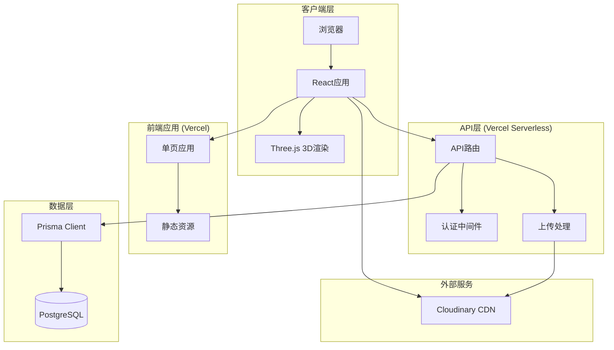
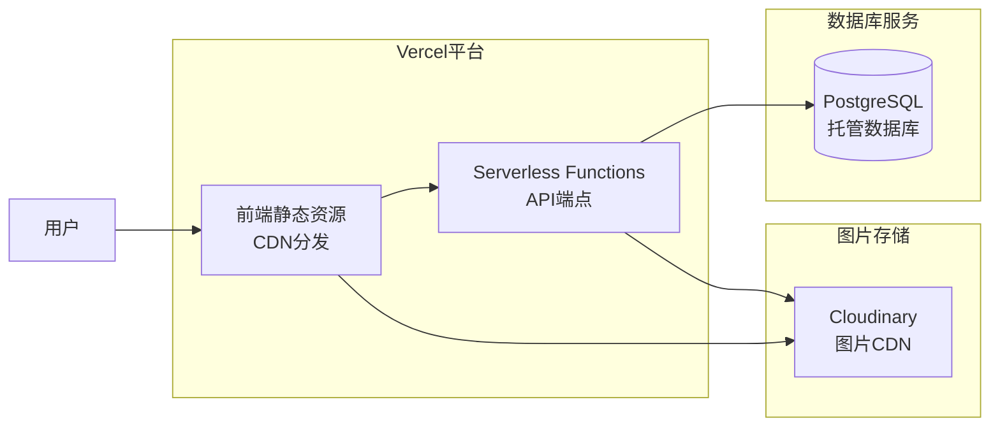

# 设计文档：后端集成迁移

## 概述

本设计文档描述了将旧网页（YIZ-guangzhou）的后端服务、数据库配置和部署配置迁移到当前前端应用（app/）的技术方案。该迁移将创建一个完整的全栈应用，保留现有的3D图片展示功能，并集成后端API、数据库持久化、用户认证和图片上传功能。

### 目标

1. 将Express后端服务迁移到新项目结构中
2. 集成Prisma ORM和PostgreSQL数据库配置
3. 实现前后端API通信
4. 配置Vercel部署支持全栈应用
5. 实现数据持久化（点赞、收藏）
6. 集成Cloudinary图片存储服务
7. 实现用户认证系统
8. 提供完整的开发和部署文档

### 技术栈

**前端:**
- React 18 + TypeScript
- Vite (构建工具)
- Three.js (3D渲染)
- TailwindCSS + shadcn/ui (UI组件)
- Framer Motion (动画)

**后端:**
- Express.js + TypeScript
- Prisma ORM
- PostgreSQL (数据库)
- Cloudinary (图片存储)
- Multer (文件上传)

**部署:**
- Vercel (前端和Serverless Functions)
- PostgreSQL (托管数据库服务)

## 架构

### 系统架构图



### 部署架构



### 项目结构

```
project-root/
├── app/                          # 前端应用
│   ├── src/
│   │   ├── components/          # React组件
│   │   ├── hooks/               # 自定义Hooks
│   │   ├── lib/                 # 工具库
│   │   ├── services/            # API服务层 (新增)
│   │   │   ├── api.ts          # API客户端
│   │   │   ├── auth.ts         # 认证服务
│   │   │   └── upload.ts       # 上传服务
│   │   ├── types/               # TypeScript类型
│   │   └── utils/               # 工具函数
│   ├── public/                  # 静态资源
│   ├── package.json
│   └── vite.config.ts
│
├── api/                          # Serverless Functions (新增)
│   ├── assets.ts                # 资源管理API
│   ├── auth.ts                  # 认证API
│   ├── health.ts                # 健康检查
│   ├── likes.ts                 # 点赞API
│   ├── favorites.ts             # 收藏API
│   └── upload.ts                # 上传API
│
├── prisma/                       # 数据库配置 (新增)
│   ├── schema.prisma            # 数据模型
│   └── migrations/              # 迁移脚本
│
├── lib/                          # 共享库 (新增)
│   ├── prisma.ts                # Prisma客户端
│   ├── cloudinary.ts            # Cloudinary配置
│   └── auth.ts                  # 认证工具
│
├── .env.example                  # 环境变量模板 (新增)
├── .gitignore
├── vercel.json                   # Vercel配置 (新增)
├── package.json                  # 根package.json (新增)
└── README.md
```

## 组件和接口

### API端点设计

#### 1. 健康检查

```typescript
GET /api/health

Response: {
  status: 'ok' | 'error',
  services: {
    database: 'connected' | 'disconnected',
    cloudinary: 'configured' | 'not configured'
  },
  timestamp: string
}
```

#### 2. 资源管理

```typescript
// 获取资源列表
GET /api/assets?folderId={folderId}&page={page}&limit={limit}

Response: {
  success: boolean,
  data: {
    items: Asset[],
    total: number,
    page: number,
    limit: number
  }
}

// 上传资源
POST /api/upload
Content-Type: multipart/form-data

Request Body: {
  file: File,
  title?: string,
  folderId?: string,
  tags?: string[]
}

Response: {
  success: boolean,
  data: Asset
}
```

#### 3. 用户认证

```typescript
// 注册
POST /api/auth/register

Request Body: {
  email: string,
  password: string,
  name: string
}

Response: {
  success: boolean,
  data: {
    user: User,
    token: string
  }
}

// 登录
POST /api/auth/login

Request Body: {
  email: string,
  password: string
}

Response: {
  success: boolean,
  data: {
    user: User,
    token: string
  }
}

// 验证会话
GET /api/auth/session
Headers: { Authorization: 'Bearer {token}' }

Response: {
  success: boolean,
  data: {
    user: User
  }
}
```

#### 4. 交互功能

```typescript
// 创建点赞
POST /api/likes
Headers: { Authorization: 'Bearer {token}' }

Request Body: {
  assetId: string
}

Response: {
  success: boolean,
  data: Like
}

// 删除点赞
DELETE /api/likes/:id
Headers: { Authorization: 'Bearer {token}' }

Response: {
  success: boolean
}

// 创建收藏
POST /api/favorites
Headers: { Authorization: 'Bearer {token}' }

Request Body: {
  assetId: string
}

Response: {
  success: boolean,
  data: Favorite
}

// 删除收藏
DELETE /api/favorites/:id
Headers: { Authorization: 'Bearer {token}' }

Response: {
  success: boolean
}

// 获取用户交互数据
GET /api/user/interactions
Headers: { Authorization: 'Bearer {token}' }

Response: {
  success: boolean,
  data: {
    likes: Like[],
    favorites: Favorite[]
  }
}
```

### 前端服务层

#### API客户端

```typescript
// app/src/services/api.ts

interface ApiResponse<T> {
  success: boolean
  data?: T
  error?: string
}

class ApiClient {
  private baseURL: string
  private token: string | null

  constructor() {
    this.baseURL = import.meta.env.VITE_API_URL || '/api'
    this.token = localStorage.getItem('auth_token')
  }

  private async request<T>(
    endpoint: string,
    options?: RequestInit
  ): Promise<ApiResponse<T>> {
    const headers: HeadersInit = {
      'Content-Type': 'application/json',
      ...options?.headers,
    }

    if (this.token) {
      headers['Authorization'] = `Bearer ${this.token}`
    }

    try {
      const response = await fetch(`${this.baseURL}${endpoint}`, {
        ...options,
        headers,
      })

      const data = await response.json()

      if (!response.ok) {
        return {
          success: false,
          error: data.error || 'Request failed',
        }
      }

      return data
    } catch (error) {
      return {
        success: false,
        error: error instanceof Error ? error.message : 'Network error',
      }
    }
  }

  // 资源相关
  async getAssets(params?: {
    folderId?: string
    page?: number
    limit?: number
  }): Promise<ApiResponse<{ items: Asset[]; total: number }>> {
    const query = new URLSearchParams(params as any).toString()
    return this.request(`/assets?${query}`)
  }

  async uploadAsset(
    file: File,
    metadata?: { title?: string; folderId?: string; tags?: string[] }
  ): Promise<ApiResponse<Asset>> {
    const formData = new FormData()
    formData.append('file', file)
    if (metadata?.title) formData.append('title', metadata.title)
    if (metadata?.folderId) formData.append('folderId', metadata.folderId)
    if (metadata?.tags) formData.append('tags', metadata.tags.join(','))

    return fetch(`${this.baseURL}/upload`, {
      method: 'POST',
      headers: this.token ? { Authorization: `Bearer ${this.token}` } : {},
      body: formData,
    }).then(res => res.json())
  }

  // 认证相关
  async login(email: string, password: string): Promise<ApiResponse<{ user: User; token: string }>> {
    const response = await this.request<{ user: User; token: string }>('/auth/login', {
      method: 'POST',
      body: JSON.stringify({ email, password }),
    })

    if (response.success && response.data) {
      this.token = response.data.token
      localStorage.setItem('auth_token', response.data.token)
    }

    return response
  }

  async register(
    email: string,
    password: string,
    name: string
  ): Promise<ApiResponse<{ user: User; token: string }>> {
    const response = await this.request<{ user: User; token: string }>('/auth/register', {
      method: 'POST',
      body: JSON.stringify({ email, password, name }),
    })

    if (response.success && response.data) {
      this.token = response.data.token
      localStorage.setItem('auth_token', response.data.token)
    }

    return response
  }

  async getSession(): Promise<ApiResponse<{ user: User }>> {
    return this.request('/auth/session')
  }

  logout() {
    this.token = null
    localStorage.removeItem('auth_token')
  }

  // 交互相关
  async createLike(assetId: string): Promise<ApiResponse<Like>> {
    return this.request('/likes', {
      method: 'POST',
      body: JSON.stringify({ assetId }),
    })
  }

  async deleteLike(likeId: string): Promise<ApiResponse<void>> {
    return this.request(`/likes/${likeId}`, {
      method: 'DELETE',
    })
  }

  async createFavorite(assetId: string): Promise<ApiResponse<Favorite>> {
    return this.request('/favorites', {
      method: 'POST',
      body: JSON.stringify({ assetId }),
    })
  }

  async deleteFavorite(favoriteId: string): Promise<ApiResponse<void>> {
    return this.request(`/favorites/${favoriteId}`, {
      method: 'DELETE',
    })
  }

  async getUserInteractions(): Promise<ApiResponse<{ likes: Like[]; favorites: Favorite[] }>> {
    return this.request('/user/interactions')
  }

  async checkHealth(): Promise<ApiResponse<{ status: string; services: any }>> {
    return this.request('/health')
  }
}

export const apiClient = new ApiClient()
```

### 认证中间件

```typescript
// lib/auth.ts

import { NextApiRequest, NextApiResponse } from 'next'
import jwt from 'jsonwebtoken'

const JWT_SECRET = process.env.JWT_SECRET || 'your-secret-key'

export interface AuthRequest extends NextApiRequest {
  userId?: string
}

export function withAuth(
  handler: (req: AuthRequest, res: NextApiResponse) => Promise<void>
) {
  return async (req: AuthRequest, res: NextApiResponse) => {
    try {
      const token = req.headers.authorization?.replace('Bearer ', '')

      if (!token) {
        return res.status(401).json({ success: false, error: 'Unauthorized' })
      }

      const decoded = jwt.verify(token, JWT_SECRET) as { userId: string }
      req.userId = decoded.userId

      return handler(req, res)
    } catch (error) {
      return res.status(401).json({ success: false, error: 'Invalid token' })
    }
  }
}

export function generateToken(userId: string): string {
  return jwt.sign({ userId }, JWT_SECRET, { expiresIn: '7d' })
}
```

## 数据模型

### Prisma Schema

```prisma
// prisma/schema.prisma

generator client {
  provider = "prisma-client-js"
}

datasource db {
  provider = "postgresql"
  url      = env("DATABASE_URL")
}

model User {
  id        String   @id @default(cuid())
  email     String   @unique
  name      String
  password  String
  createdAt DateTime @default(now())
  updatedAt DateTime @updatedAt

  assets    Asset[]
  likes     Like[]
  favorites Favorite[]
  folders   Folder[]

  @@map("users")
}

model Asset {
  id           String   @id @default(cuid())
  title        String
  url          String
  thumbnailUrl String
  size         Int
  folderId     String?
  userId       String
  createdAt    DateTime @default(now())
  updatedAt    DateTime @updatedAt

  user      User       @relation(fields: [userId], references: [id], onDelete: Cascade)
  folder    Folder?    @relation(fields: [folderId], references: [id], onDelete: SetNull)
  likes     Like[]
  favorites Favorite[]
  tags      AssetTag[]

  @@index([userId])
  @@index([folderId])
  @@index([createdAt])
  @@map("assets")
}

model Folder {
  id        String   @id @default(cuid())
  name      String
  userId    String
  createdAt DateTime @default(now())
  updatedAt DateTime @updatedAt

  user   User    @relation(fields: [userId], references: [id], onDelete: Cascade)
  assets Asset[]

  @@index([userId])
  @@map("folders")
}

model Tag {
  id        String   @id @default(cuid())
  name      String   @unique
  createdAt DateTime @default(now())

  assets AssetTag[]

  @@map("tags")
}

model AssetTag {
  assetId String
  tagId   String

  asset Asset @relation(fields: [assetId], references: [id], onDelete: Cascade)
  tag   Tag   @relation(fields: [tagId], references: [id], onDelete: Cascade)

  @@id([assetId, tagId])
  @@map("asset_tags")
}

model Like {
  id        String   @id @default(cuid())
  assetId   String
  userId    String
  createdAt DateTime @default(now())

  asset Asset @relation(fields: [assetId], references: [id], onDelete: Cascade)
  user  User  @relation(fields: [userId], references: [id], onDelete: Cascade)

  @@unique([assetId, userId])
  @@index([userId])
  @@index([assetId])
  @@map("likes")
}

model Favorite {
  id        String   @id @default(cuid())
  assetId   String
  userId    String
  createdAt DateTime @default(now())

  asset Asset @relation(fields: [assetId], references: [id], onDelete: Cascade)
  user  User  @relation(fields: [userId], references: [id], onDelete: Cascade)

  @@unique([assetId, userId])
  @@index([userId])
  @@index([assetId])
  @@map("favorites")
}
```

### TypeScript类型定义

```typescript
// app/src/types/api.ts

export interface User {
  id: string
  email: string
  name: string
  createdAt: string
  updatedAt: string
}

export interface Asset {
  id: string
  title: string
  url: string
  thumbnailUrl: string
  size: number
  folderId: string | null
  userId: string
  createdAt: string
  updatedAt: string
  tags?: Tag[]
  likesCount?: number
  favoritesCount?: number
  isLiked?: boolean
  isFavorited?: boolean
}

export interface Folder {
  id: string
  name: string
  userId: string
  createdAt: string
  updatedAt: string
}

export interface Tag {
  id: string
  name: string
  createdAt: string
}

export interface Like {
  id: string
  assetId: string
  userId: string
  createdAt: string
}

export interface Favorite {
  id: string
  assetId: string
  userId: string
  createdAt: string
}
```


## 正确性属性

*属性是一个特征或行为，应该在系统的所有有效执行中保持为真——本质上是关于系统应该做什么的正式陈述。属性作为人类可读规范和机器可验证正确性保证之间的桥梁。*

### 属性反思

在分析了所有验收标准后，我识别出以下可测试的属性。许多验收标准涉及配置、文档和项目结构，这些不适合自动化测试。以下属性专注于运行时行为和API功能：

**冗余分析:**
- 属性8.1和8.2（点赞和收藏的创建）具有相同的模式，但它们测试不同的功能，应该保留
- 属性8.4-8.8（API端点存在性）可以合并为一个综合的API端点可用性测试
- 属性9.2和9.3都涉及使用API数据，但测试不同的方面，应该保留
- 属性10.4和10.5涉及登录流程的不同步骤，应该保留
- 属性11.8和11.9都是文件验证，但测试不同的验证规则，应该保留

### 属性 1: API错误响应格式

*对于任何*失败的API请求，响应对象应该包含success字段为false和包含错误描述的error字段

**验证需求: 4.6**

### 属性 2: 文件夹筛选正确性

*对于任何*资源列表和文件夹ID，按该文件夹ID筛选后返回的所有资源的folderId应该等于指定的文件夹ID

**验证需求: 4.4**

### 属性 3: 点赞持久化

*对于任何*资源和已认证用户，当用户创建点赞时，该点赞记录应该被保存到数据库，并且可以通过用户交互API检索到

**验证需求: 8.1, 8.3**

### 属性 4: 收藏持久化

*对于任何*资源和已认证用户，当用户创建收藏时，该收藏记录应该被保存到数据库，并且可以通过用户交互API检索到

**验证需求: 8.2, 8.3**

### 属性 5: 必需API端点可用性

*对于任何*已启动的后端服务，所有必需的API端点（/api/likes, /api/favorites, /api/user/interactions, /api/upload, /api/assets）应该响应相应的HTTP方法而不返回404错误

**验证需求: 8.4, 8.5, 8.6, 8.7, 8.8**

### 属性 6: API数据使用

*对于任何*从API获取的资源列表，前端应该使用这些资源的url和thumbnailUrl字段来渲染图片，而不是使用硬编码的数据

**验证需求: 9.2, 9.3**

### 属性 7: 认证令牌存储

*对于任何*成功的登录或注册响应，如果响应包含token字段，该token应该被存储到localStorage中的auth_token键下

**验证需求: 10.5**

### 属性 8: 认证请求头

*对于任何*需要认证的API请求，如果localStorage中存在auth_token，请求头应该包含格式为"Bearer {token}"的Authorization字段

**验证需求: 10.6**

### 属性 9: 后端令牌验证

*对于任何*需要认证的API端点，当请求不包含有效的Authorization令牌时，应该返回401状态码和错误响应

**验证需求: 10.8**

### 属性 10: 上传成功后列表更新

*对于任何*成功的图片上传，上传完成后重新获取的资源列表应该包含新上传的资源

**验证需求: 11.6**

### 属性 11: 文件大小验证

*对于任何*大小超过10MB的文件，上传请求应该被拒绝并返回413状态码或包含文件大小错误的响应

**验证需求: 11.8**

### 属性 12: 文件类型验证

*对于任何*非图片格式的文件（MIME类型不以image/开头），上传请求应该被拒绝并返回包含文件类型错误的响应

**验证需求: 11.9**

### 属性 13: 健康检查响应格式

*对于任何*健康检查请求（GET /api/health），响应应该包含status字段和services对象，services对象应该包含database和cloudinary的状态信息

**验证需求: 12.6**

## 错误处理

### 错误类型和处理策略

#### 1. 网络错误

**场景:** API请求失败（网络断开、超时、服务器不可达）

**处理策略:**
- 捕获fetch错误并返回标准化的错误响应
- 显示用户友好的错误消息
- 提供重试选项
- 在开发环境记录详细错误信息

```typescript
// 示例实现
try {
  const response = await fetch(url, options)
  // ...
} catch (error) {
  console.error('Network error:', error)
  return {
    success: false,
    error: '网络连接失败，请检查您的网络连接后重试'
  }
}
```

#### 2. 认证错误

**场景:** 令牌无效、过期或缺失

**处理策略:**
- 检测401状态码
- 清除本地存储的令牌
- 重定向到登录页面
- 显示会话过期提示

```typescript
if (response.status === 401) {
  localStorage.removeItem('auth_token')
  // 触发登录模态框或重定向
  showLoginModal()
  return {
    success: false,
    error: '会话已过期，请重新登录'
  }
}
```

#### 3. 验证错误

**场景:** 文件大小超限、文件类型不支持、必填字段缺失

**处理策略:**
- 前端预验证（文件大小、类型）
- 后端二次验证
- 返回具体的验证错误信息
- 高亮显示错误字段

```typescript
// 前端预验证
if (file.size > 10 * 1024 * 1024) {
  return {
    success: false,
    error: '文件大小不能超过10MB'
  }
}

if (!file.type.startsWith('image/')) {
  return {
    success: false,
    error: '只支持图片格式文件'
  }
}
```

#### 4. 服务器错误

**场景:** 数据库连接失败、Cloudinary服务不可用、内部服务器错误

**处理策略:**
- 捕获所有未处理的异常
- 记录详细错误日志（包括堆栈跟踪）
- 返回通用错误消息（不暴露内部细节）
- 在健康检查端点报告服务状态

```typescript
// 后端错误处理中间件
app.use((error: Error, req: Request, res: Response, next: NextFunction) => {
  console.error('Server error:', {
    message: error.message,
    stack: error.stack,
    url: req.url,
    method: req.method
  })

  res.status(500).json({
    success: false,
    error: '服务器内部错误，请稍后重试'
  })
})
```

#### 5. 配置错误

**场景:** 环境变量缺失、数据库连接字符串无效

**处理策略:**
- 启动时验证所有必需的环境变量
- 缺失配置时拒绝启动
- 记录详细的配置错误信息
- 提供配置检查清单

```typescript
// 启动时配置验证
function validateConfig() {
  const required = [
    'DATABASE_URL',
    'CLOUDINARY_CLOUD_NAME',
    'CLOUDINARY_API_KEY',
    'CLOUDINARY_API_SECRET',
    'JWT_SECRET'
  ]

  const missing = required.filter(key => !process.env[key])

  if (missing.length > 0) {
    console.error('Missing required environment variables:', missing)
    console.error('Please check your .env file and ensure all required variables are set')
    process.exit(1)
  }
}

validateConfig()
```

### 错误响应格式标准

所有API错误响应应遵循统一格式：

```typescript
interface ErrorResponse {
  success: false
  error: string          // 用户友好的错误消息
  code?: string          // 错误代码（可选）
  details?: any          // 详细错误信息（仅开发环境）
}
```

### 前端错误显示

**Toast通知:** 用于临时错误消息（网络错误、操作失败）

**模态框:** 用于需要用户确认的错误（会话过期、权限不足）

**内联错误:** 用于表单验证错误

**空状态:** 用于数据加载失败或无数据的情况

## 测试策略

### 测试方法概述

本项目采用双重测试方法，结合单元测试和基于属性的测试，以确保全面的代码覆盖和正确性验证。

**单元测试:**
- 验证特定示例和边缘情况
- 测试组件集成点
- 测试错误条件和异常处理
- 使用Vitest作为测试框架

**基于属性的测试:**
- 验证跨所有输入的通用属性
- 通过随机化实现全面的输入覆盖
- 使用fast-check库进行属性测试
- 每个属性测试最少运行100次迭代

### 测试配置

#### 前端测试配置

```typescript
// app/vite.config.ts
import { defineConfig } from 'vite'
import react from '@vitejs/plugin-react'

export default defineConfig({
  plugins: [react()],
  test: {
    globals: true,
    environment: 'jsdom',
    setupFiles: './src/test/setup.ts',
    coverage: {
      provider: 'v8',
      reporter: ['text', 'json', 'html'],
      exclude: [
        'node_modules/',
        'src/test/',
        '**/*.d.ts',
        '**/*.config.*',
        '**/mockData',
        'dist/'
      ]
    }
  }
})
```

#### 后端测试配置

```json
// package.json
{
  "scripts": {
    "test": "vitest run",
    "test:watch": "vitest",
    "test:coverage": "vitest run --coverage"
  },
  "devDependencies": {
    "vitest": "^1.0.0",
    "fast-check": "^3.15.0",
    "@vitest/coverage-v8": "^1.0.0"
  }
}
```

### 单元测试示例

#### API客户端测试

```typescript
// app/src/services/__tests__/api.test.ts
import { describe, it, expect, beforeEach, vi } from 'vitest'
import { apiClient } from '../api'

describe('API Client', () => {
  beforeEach(() => {
    localStorage.clear()
    vi.clearAllMocks()
  })

  it('should include auth token in authenticated requests', async () => {
    const token = 'test-token'
    localStorage.setItem('auth_token', token)

    const fetchSpy = vi.spyOn(global, 'fetch').mockResolvedValue({
      ok: true,
      json: async () => ({ success: true, data: [] })
    } as Response)

    await apiClient.getUserInteractions()

    expect(fetchSpy).toHaveBeenCalledWith(
      expect.any(String),
      expect.objectContaining({
        headers: expect.objectContaining({
          'Authorization': `Bearer ${token}`
        })
      })
    )
  })

  it('should handle network errors gracefully', async () => {
    vi.spyOn(global, 'fetch').mockRejectedValue(new Error('Network error'))

    const result = await apiClient.getAssets()

    expect(result.success).toBe(false)
    expect(result.error).toBeDefined()
  })

  it('should reject files larger than 10MB', async () => {
    const largeFile = new File(['x'.repeat(11 * 1024 * 1024)], 'large.jpg', {
      type: 'image/jpeg'
    })

    const result = await apiClient.uploadAsset(largeFile)

    expect(result.success).toBe(false)
    expect(result.error).toContain('10MB')
  })
})
```

#### 认证中间件测试

```typescript
// lib/__tests__/auth.test.ts
import { describe, it, expect } from 'vitest'
import { generateToken, withAuth } from '../auth'
import jwt from 'jsonwebtoken'

describe('Authentication', () => {
  it('should generate valid JWT tokens', () => {
    const userId = 'user-123'
    const token = generateToken(userId)

    const decoded = jwt.verify(token, process.env.JWT_SECRET!) as any
    expect(decoded.userId).toBe(userId)
  })

  it('should reject requests without token', async () => {
    const mockReq = { headers: {} } as any
    const mockRes = {
      status: vi.fn().mockReturnThis(),
      json: vi.fn()
    } as any

    const handler = withAuth(async (req, res) => {
      res.json({ success: true })
    })

    await handler(mockReq, mockRes)

    expect(mockRes.status).toHaveBeenCalledWith(401)
    expect(mockRes.json).toHaveBeenCalledWith(
      expect.objectContaining({ success: false })
    )
  })
})
```

### 基于属性的测试

#### 属性测试配置

每个属性测试必须：
- 使用fast-check库生成随机输入
- 运行至少100次迭代
- 包含标签注释引用设计文档中的属性

```typescript
import * as fc from 'fast-check'

// 配置
const testConfig = {
  numRuns: 100,  // 最少迭代次数
  verbose: true
}
```

#### 属性 1: API错误响应格式

```typescript
// api/__tests__/error-response.property.test.ts
import { describe, it } from 'vitest'
import * as fc from 'fast-check'

/**
 * Feature: backend-integration-migration, Property 1:
 * 对于任何失败的API请求，响应对象应该包含success字段为false和包含错误描述的error字段
 */
describe('Property 1: API Error Response Format', () => {
  it('should return standardized error format for all failed requests', async () => {
    await fc.assert(
      fc.asyncProperty(
        fc.oneof(
          fc.constant('network-error'),
          fc.constant('validation-error'),
          fc.constant('auth-error'),
          fc.constant('server-error')
        ),
        async (errorType) => {
          // 模拟不同类型的错误
          const response = await simulateErrorRequest(errorType)

          // 验证错误响应格式
          expect(response.success).toBe(false)
          expect(response.error).toBeDefined()
          expect(typeof response.error).toBe('string')
          expect(response.error.length).toBeGreaterThan(0)
        }
      ),
      { numRuns: 100 }
    )
  })
})
```

#### 属性 2: 文件夹筛选正确性

```typescript
// api/__tests__/folder-filter.property.test.ts
/**
 * Feature: backend-integration-migration, Property 2:
 * 对于任何资源列表和文件夹ID，按该文件夹ID筛选后返回的所有资源的folderId应该等于指定的文件夹ID
 */
describe('Property 2: Folder Filter Correctness', () => {
  it('should only return assets matching the folder ID', async () => {
    await fc.assert(
      fc.asyncProperty(
        fc.array(fc.record({
          id: fc.uuid(),
          title: fc.string(),
          folderId: fc.option(fc.uuid(), { nil: null })
        })),
        fc.uuid(),
        async (assets, targetFolderId) => {
          // 创建测试数据
          await seedAssets(assets)

          // 执行筛选
          const result = await apiClient.getAssets({ folderId: targetFolderId })

          // 验证所有返回的资源都属于目标文件夹
          if (result.success && result.data) {
            result.data.items.forEach(asset => {
              expect(asset.folderId).toBe(targetFolderId)
            })
          }
        }
      ),
      { numRuns: 100 }
    )
  })
})
```

#### 属性 3-4: 点赞和收藏持久化

```typescript
// api/__tests__/interaction-persistence.property.test.ts
/**
 * Feature: backend-integration-migration, Property 3:
 * 对于任何资源和已认证用户，当用户创建点赞时，该点赞记录应该被保存到数据库，并且可以通过用户交互API检索到
 */
describe('Property 3: Like Persistence', () => {
  it('should persist likes and retrieve them via interactions API', async () => {
    await fc.assert(
      fc.asyncProperty(
        fc.uuid(), // assetId
        fc.uuid(), // userId
        async (assetId, userId) => {
          // 创建点赞
          const createResult = await apiClient.createLike(assetId)
          expect(createResult.success).toBe(true)

          // 获取用户交互数据
          const interactionsResult = await apiClient.getUserInteractions()
          expect(interactionsResult.success).toBe(true)

          // 验证点赞存在
          const likeExists = interactionsResult.data?.likes.some(
            like => like.assetId === assetId
          )
          expect(likeExists).toBe(true)
        }
      ),
      { numRuns: 100 }
    )
  })
})

/**
 * Feature: backend-integration-migration, Property 4:
 * 对于任何资源和已认证用户，当用户创建收藏时，该收藏记录应该被保存到数据库，并且可以通过用户交互API检索到
 */
describe('Property 4: Favorite Persistence', () => {
  it('should persist favorites and retrieve them via interactions API', async () => {
    await fc.assert(
      fc.asyncProperty(
        fc.uuid(),
        fc.uuid(),
        async (assetId, userId) => {
          const createResult = await apiClient.createFavorite(assetId)
          expect(createResult.success).toBe(true)

          const interactionsResult = await apiClient.getUserInteractions()
          expect(interactionsResult.success).toBe(true)

          const favoriteExists = interactionsResult.data?.favorites.some(
            fav => fav.assetId === assetId
          )
          expect(favoriteExists).toBe(true)
        }
      ),
      { numRuns: 100 }
    )
  })
})
```

#### 属性 11-12: 文件验证

```typescript
// api/__tests__/file-validation.property.test.ts
/**
 * Feature: backend-integration-migration, Property 11:
 * 对于任何大小超过10MB的文件，上传请求应该被拒绝并返回413状态码或包含文件大小错误的响应
 */
describe('Property 11: File Size Validation', () => {
  it('should reject files larger than 10MB', async () => {
    await fc.assert(
      fc.asyncProperty(
        fc.integer({ min: 10 * 1024 * 1024 + 1, max: 50 * 1024 * 1024 }),
        async (fileSize) => {
          const largeFile = new File(
            [new ArrayBuffer(fileSize)],
            'large.jpg',
            { type: 'image/jpeg' }
          )

          const result = await apiClient.uploadAsset(largeFile)

          expect(result.success).toBe(false)
          expect(
            result.error?.includes('10MB') ||
            result.error?.includes('大小') ||
            result.error?.includes('size')
          ).toBe(true)
        }
      ),
      { numRuns: 100 }
    )
  })
})

/**
 * Feature: backend-integration-migration, Property 12:
 * 对于任何非图片格式的文件，上传请求应该被拒绝并返回包含文件类型错误的响应
 */
describe('Property 12: File Type Validation', () => {
  it('should reject non-image files', async () => {
    await fc.assert(
      fc.asyncProperty(
        fc.oneof(
          fc.constant('application/pdf'),
          fc.constant('text/plain'),
          fc.constant('video/mp4'),
          fc.constant('application/zip')
        ),
        async (mimeType) => {
          const file = new File(['content'], 'file.txt', { type: mimeType })

          const result = await apiClient.uploadAsset(file)

          expect(result.success).toBe(false)
          expect(
            result.error?.includes('图片') ||
            result.error?.includes('image') ||
            result.error?.includes('格式') ||
            result.error?.includes('type')
          ).toBe(true)
        }
      ),
      { numRuns: 100 }
    )
  })
})
```

### 集成测试

#### 端到端流程测试

```typescript
// e2e/__tests__/upload-flow.test.ts
describe('Image Upload Flow', () => {
  it('should complete full upload workflow', async () => {
    // 1. 用户登录
    const loginResult = await apiClient.login('test@example.com', 'password')
    expect(loginResult.success).toBe(true)

    // 2. 上传图片
    const file = new File(['image data'], 'test.jpg', { type: 'image/jpeg' })
    const uploadResult = await apiClient.uploadAsset(file, {
      title: 'Test Image'
    })
    expect(uploadResult.success).toBe(true)

    // 3. 验证图片出现在列表中
    const assetsResult = await apiClient.getAssets()
    expect(assetsResult.success).toBe(true)
    expect(assetsResult.data?.items).toContainEqual(
      expect.objectContaining({
        title: 'Test Image'
      })
    )

    // 4. 点赞图片
    const likeResult = await apiClient.createLike(uploadResult.data!.id)
    expect(likeResult.success).toBe(true)

    // 5. 验证点赞记录
    const interactionsResult = await apiClient.getUserInteractions()
    expect(interactionsResult.data?.likes).toContainEqual(
      expect.objectContaining({
        assetId: uploadResult.data!.id
      })
    )
  })
})
```

### 测试覆盖率目标

- 单元测试覆盖率: ≥80%
- API端点覆盖率: 100%
- 关键业务逻辑覆盖率: ≥90%
- 属性测试: 覆盖所有13个正确性属性

### 持续集成

```yaml
# .github/workflows/test.yml
name: Tests

on: [push, pull_request]

jobs:
  test:
    runs-on: ubuntu-latest
    
    steps:
      - uses: actions/checkout@v3
      
      - name: Setup Node.js
        uses: actions/setup-node@v3
        with:
          node-version: '18'
      
      - name: Install dependencies
        run: npm ci
      
      - name: Run unit tests
        run: npm test
      
      - name: Run property tests
        run: npm run test:property
      
      - name: Generate coverage report
        run: npm run test:coverage
      
      - name: Upload coverage
        uses: codecov/codecov-action@v3
```

