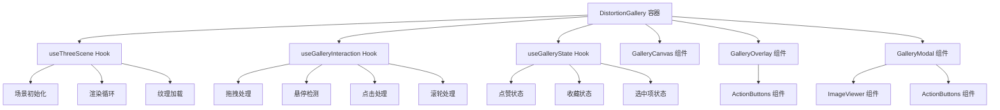
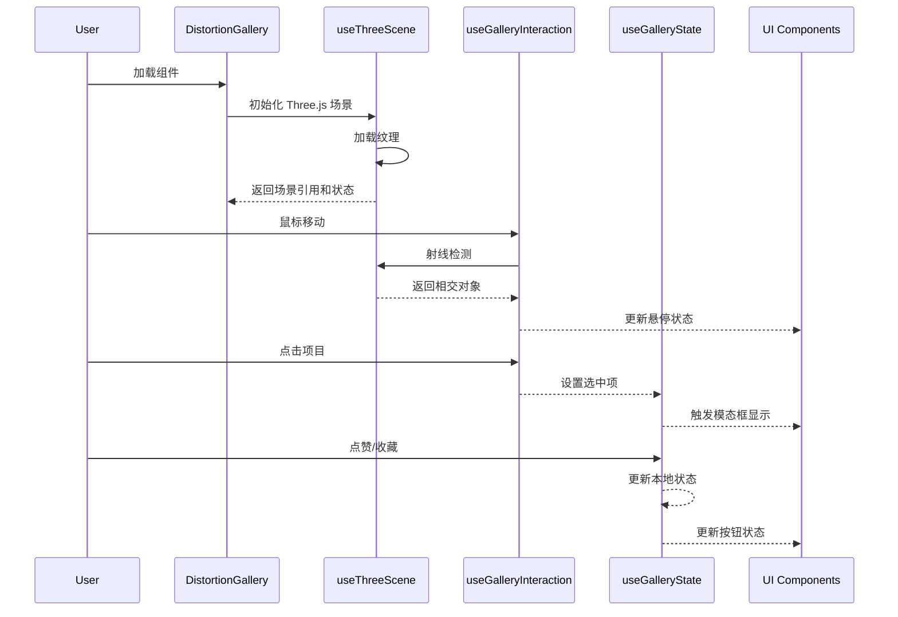

# 设计文档：画廊优化 (Gallery Optimization)

## 概述

对现有的 DistortionGallery 组件（约 500 行）进行重构优化，应用 frontend-dev skill 最佳实践。当前组件将 Three.js 场景管理、交互逻辑、UI 渲染、状态管理混合在一起，违反了单一职责原则。本设计将组件拆分为更小的、可维护的模块，提取自定义 hooks，优化性能，增强可访问性，并建立完整的测试策略。

## 架构设计

### 整体架构图



### 组件层次结构

```
DistortionGallery (容器组件)
├── GalleryCanvas (Three.js 渲染层)
├── LoadingState (加载状态)
├── GalleryOverlay (悬停交互层)
│   └── ActionButtons (操作按钮)
└── GalleryModal (详情弹窗)
    ├── ImageViewer (图片查看器)
    └── ActionButtons (操作按钮)
```

### 数据流图



## 核心接口与类型定义

### 类型定义

```typescript
// types/gallery.ts

export interface GalleryItem {
  id: number;
  title: string;
  brand: string;
  category: string[];
  year: string;
  image: string;
}

export interface GalleryInteractionState {
  hoveredIndex: number | null;
  selectedItem: GalleryItem | null;
  isDragging: boolean;
}

export interface GalleryUserActions {
  likes: Set<number>;
  bookmarks: Set<number>;
}

export interface ThreeSceneRefs {
  scene: THREE.Scene;
  camera: THREE.OrthographicCamera;
  renderer: THREE.WebGLRenderer;
  composer: EffectComposer;
  meshes: THREE.Mesh[];
  raycaster: THREE.Raycaster;
}

export interface GalleryOffset {
  x: number;
  y: number;
}

export interface GalleryVelocity {
  x: number;
  y: number;
}
```

### 组件接口

```typescript
// components/DistortionGallery/DistortionGallery.tsx

export interface DistortionGalleryProps {
  items: GalleryItem[];
  onItemSelect?: (item: GalleryItem) => void;
  onLike?: (itemId: number) => void;
  onBookmark?: (itemId: number) => void;
  initialLikes?: Set<number>;
  initialBookmarks?: Set<number>;
}

// components/GalleryCanvas/GalleryCanvas.tsx

export interface GalleryCanvasProps {
  containerRef: React.RefObject<HTMLDivElement>;
  items: GalleryItem[];
  onLoadComplete: () => void;
  onHoverChange: (index: number | null) => void;
  onItemClick: (item: GalleryItem) => void;
}

// components/GalleryOverlay/GalleryOverlay.tsx

export interface GalleryOverlayProps {
  hoveredItem: GalleryItem | null;
  isLiked: boolean;
  isBookmarked: boolean;
  onLike: () => void;
  onBookmark: () => void;
}

// components/GalleryModal/GalleryModal.tsx

export interface GalleryModalProps {
  item: GalleryItem | null;
  isLiked: boolean;
  isBookmarked: boolean;
  onClose: () => void;
  onLike: () => void;
  onBookmark: () => void;
}

// components/ActionButtons/ActionButtons.tsx

export interface ActionButtonsProps {
  isLiked: boolean;
  isBookmarked: boolean;
  onLike: () => void;
  onBookmark: () => void;
  variant?: 'overlay' | 'modal';
}
```

## 自定义 Hooks 设计

### useThreeScene Hook

```typescript
// hooks/useThreeScene.ts

interface UseThreeSceneOptions {
  items: GalleryItem[];
  containerRef: React.RefObject<HTMLDivElement>;
  onLoadComplete: () => void;
}

interface UseThreeSceneReturn {
  sceneRefs: ThreeSceneRefs | null;
  isLoading: boolean;
  error: Error | null;
}

function useThreeScene(options: UseThreeSceneOptions): UseThreeSceneReturn
```

**前置条件：**
- `containerRef.current` 不为 null
- `items` 数组非空且每个项包含有效的 `image` URL

**后置条件：**
- 返回初始化的 Three.js 场景引用
- 所有纹理加载完成后 `isLoading` 为 false
- 如果加载失败，`error` 包含错误信息
- 场景在组件卸载时正确清理

**职责：**
- 初始化 Three.js 场景、相机、渲染器
- 创建扭曲效果的后处理管线
- 加载和处理图片纹理（圆角处理）
- 创建网格布局
- 管理渲染循环
- 处理窗口大小调整
- 清理资源

### useGalleryInteraction Hook

```typescript
// hooks/useGalleryInteraction.ts

interface UseGalleryInteractionOptions {
  sceneRefs: ThreeSceneRefs | null;
  containerRef: React.RefObject<HTMLDivElement>;
  items: GalleryItem[];
  onHoverChange: (index: number | null) => void;
  onItemClick: (item: GalleryItem) => void;
}

interface UseGalleryInteractionReturn {
  gridOffset: GalleryOffset;
  distortion: number;
}

function useGalleryInteraction(
  options: UseGalleryInteractionOptions
): UseGalleryInteractionReturn
```

**前置条件：**
- `sceneRefs` 已初始化且包含有效的场景对象
- `containerRef.current` 不为 null
- `items` 数组与场景中的网格对应

**后置条件：**
- 正确处理所有用户交互事件（拖拽、悬停、点击、滚轮）
- 拖拽时更新网格偏移量和扭曲效果
- 悬停时触发 `onHoverChange` 回调
- 点击时触发 `onItemClick` 回调
- 组件卸载时移除所有事件监听器

**职责：**
- 处理指针事件（down, move, up, leave）
- 实现拖拽逻辑和惯性滚动
- 射线检测和悬停状态管理
- 区分拖拽和点击操作
- 处理滚轮事件
- 动态调整扭曲效果强度
- 管理光标样式

### useGalleryState Hook

```typescript
// hooks/useGalleryState.ts

interface UseGalleryStateOptions {
  items: GalleryItem[];
  initialLikes?: Set<number>;
  initialBookmarks?: Set<number>;
  onLike?: (itemId: number) => void;
  onBookmark?: (itemId: number) => void;
  onItemSelect?: (item: GalleryItem) => void;
}

interface UseGalleryStateReturn {
  hoveredIndex: number | null;
  setHoveredIndex: (index: number | null) => void;
  selectedItem: GalleryItem | null;
  setSelectedItem: (item: GalleryItem | null) => void;
  likes: Set<number>;
  bookmarks: Set<number>;
  toggleLike: (itemId: number) => void;
  toggleBookmark: (itemId: number) => void;
  isLiked: (itemId: number) => boolean;
  isBookmarked: (itemId: number) => boolean;
}

function useGalleryState(
  options: UseGalleryStateOptions
): UseGalleryStateReturn
```

**前置条件：**
- `items` 数组非空
- `initialLikes` 和 `initialBookmarks`（如果提供）包含有效的项目 ID

**后置条件：**
- 正确管理悬停、选中、点赞、收藏状态
- 状态变更时触发相应的回调函数
- 状态更新是不可变的（使用新的 Set 实例）

**职责：**
- 管理悬停项索引
- 管理选中项状态
- 管理点赞和收藏状态
- 提供状态查询和切换方法
- 触发外部回调

### useImageLoader Hook

```typescript
// hooks/useImageLoader.ts

interface UseImageLoaderOptions {
  images: string[];
  onProgress?: (loaded: number, total: number) => void;
  onComplete?: () => void;
  onError?: (error: Error) => void;
}

interface UseImageLoaderReturn {
  textures: THREE.Texture[];
  isLoading: boolean;
  progress: number;
  error: Error | null;
}

function useImageLoader(
  options: UseImageLoaderOptions
): UseImageLoaderReturn
```

**前置条件：**
- `images` 数组包含有效的图片 URL

**后置条件：**
- 所有图片加载完成后返回纹理数组
- 加载进度通过 `progress` 字段反映（0-100）
- 加载完成时 `isLoading` 为 false
- 加载失败时 `error` 包含错误信息

**职责：**
- 并行加载多张图片
- 应用圆角处理
- 创建 Three.js 纹理
- 跟踪加载进度
- 处理加载错误
- 优化内存使用

## 算法伪代码

### 主渲染循环算法

```pascal
ALGORITHM animateGalleryScene(sceneRefs, gridOffset, velocity, distortion)
INPUT: 
  sceneRefs: ThreeSceneRefs (场景引用)
  gridOffset: GalleryOffset (当前网格偏移)
  velocity: GalleryVelocity (当前速度)
  distortion: number (当前扭曲值)
OUTPUT: void (持续渲染)

PRECONDITION:
  sceneRefs.scene ≠ null ∧ 
  sceneRefs.renderer ≠ null ∧
  sceneRefs.composer ≠ null

BEGIN
  animationId ← requestAnimationFrame(animateGalleryScene)
  
  // 应用惯性衰减
  IF NOT isDragging THEN
    targetOffset.x ← targetOffset.x + velocity.x
    targetOffset.y ← targetOffset.y + velocity.y
    velocity.x ← velocity.x × FRICTION_COEFFICIENT
    velocity.y ← velocity.y × FRICTION_COEFFICIENT
    
    // 根据速度计算扭曲
    speed ← √(velocity.x² + velocity.y²)
    IF speed > VELOCITY_THRESHOLD THEN
      targetDistortion ← min(speed × DISTORTION_FACTOR, MAX_DISTORTION)
    ELSE
      targetDistortion ← 0
    END IF
  END IF
  
  // 平滑插值
  gridOffset.x ← gridOffset.x + (targetOffset.x - gridOffset.x) × LERP_FACTOR
  gridOffset.y ← gridOffset.y + (targetOffset.y - gridOffset.y) × LERP_FACTOR
  currentDistortion ← currentDistortion + (targetDistortion - currentDistortion) × LERP_FACTOR
  
  // 更新场景
  sceneRefs.distortionPass.uniforms.distortion.value ← currentDistortion
  sceneRefs.gridGroup.position.set(gridOffset.x, gridOffset.y, 0)
  
  // 渲染
  sceneRefs.composer.render()
  
  ASSERT sceneRefs.renderer.info.render.frame > 0
END

POSTCONDITION:
  场景已渲染一帧 ∧
  网格位置已更新 ∧
  扭曲效果已应用
```

**循环不变式：**
- 每次迭代后，`gridOffset` 向 `targetOffset` 收敛
- `velocity` 在非拖拽状态下持续衰减
- `currentDistortion` 向 `targetDistortion` 平滑过渡
- 渲染帧数单调递增

### 拖拽交互算法

```pascal
ALGORITHM handleDragInteraction(event, state, sceneRefs)
INPUT:
  event: PointerEvent (指针事件)
  state: InteractionState (交互状态)
  sceneRefs: ThreeSceneRefs (场景引用)
OUTPUT: void (更新状态)

PRECONDITION:
  event ≠ null ∧
  state.containerRef.current ≠ null ∧
  sceneRefs.meshes.length > 0

BEGIN
  MATCH event.type WITH
    CASE "pointerdown":
      state.isDragging ← true
      state.hasMoved ← false
      state.dragStartPos ← {x: event.clientX, y: event.clientY}
      state.previousMouse ← {x: event.clientX, y: event.clientY}
      state.velocity ← {x: 0, y: 0}
      
    CASE "pointermove":
      IF NOT state.isDragging THEN
        // 悬停检测
        mouse ← convertToNDC(event, state.containerRef.current)
        sceneRefs.raycaster.setFromCamera(mouse, sceneRefs.camera)
        intersects ← sceneRefs.raycaster.intersectObjects(sceneRefs.meshes)
        
        IF intersects.length > 0 THEN
          itemIndex ← intersects[0].object.userData.itemIndex
          state.onHoverChange(itemIndex)
          cursor ← "pointer"
        ELSE
          state.onHoverChange(null)
          cursor ← "grab"
        END IF
      ELSE
        // 拖拽逻辑
        cursor ← "grabbing"
        state.onHoverChange(null)
        
        // 检测移动距离
        moveDistance ← √((event.clientX - state.dragStartPos.x)² + 
                         (event.clientY - state.dragStartPos.y)²)
        IF moveDistance > DRAG_THRESHOLD THEN
          state.hasMoved ← true
        END IF
        
        // 计算增量和速度
        deltaX ← (event.clientX - state.previousMouse.x) / window.innerWidth
        deltaY ← (event.clientY - state.previousMouse.y) / window.innerHeight
        
        state.targetOffset.x ← state.targetOffset.x + deltaX × DRAG_SENSITIVITY
        state.targetOffset.y ← state.targetOffset.y + deltaY × DRAG_SENSITIVITY
        state.velocity ← {x: deltaX × DRAG_SENSITIVITY, y: deltaY × DRAG_SENSITIVITY}
        
        speed ← √(state.velocity.x² + state.velocity.y²)
        state.targetDistortion ← min(speed × DISTORTION_FACTOR, MAX_DISTORTION)
        
        state.previousMouse ← {x: event.clientX, y: event.clientY}
      END IF
      
    CASE "pointerup":
      wasDragging ← state.isDragging
      state.isDragging ← false
      state.targetDistortion ← 0
      
      // 只在未移动时触发点击
      IF wasDragging AND NOT state.hasMoved THEN
        mouse ← convertToNDC(event, state.containerRef.current)
        sceneRefs.raycaster.setFromCamera(mouse, sceneRefs.camera)
        intersects ← sceneRefs.raycaster.intersectObjects(sceneRefs.meshes)
        
        IF intersects.length > 0 THEN
          itemIndex ← intersects[0].object.userData.itemIndex
          state.onItemClick(state.items[itemIndex])
        END IF
      END IF
      
      state.hasMoved ← false
      cursor ← "grab"
  END MATCH
  
  ASSERT state.isDragging ⟹ state.velocity ≠ null
END

POSTCONDITION:
  交互状态已更新 ∧
  (state.hasMoved = true ⟹ moveDistance > DRAG_THRESHOLD) ∧
  (点击触发 ⟹ NOT state.hasMoved)
```

**循环不变式：**
- 拖拽过程中，`previousMouse` 始终保存上一帧的鼠标位置
- `velocity` 反映最近一次移动的速度
- `hasMoved` 一旦为 true 在当前拖拽会话中保持为 true

### 纹理加载与圆角处理算法

```pascal
ALGORITHM loadTexturesWithRoundedCorners(imageUrls, radius)
INPUT:
  imageUrls: Array<string> (图片 URL 数组)
  radius: number (圆角半径，像素)
OUTPUT:
  textures: Array<THREE.Texture> (纹理数组)

PRECONDITION:
  imageUrls.length > 0 ∧
  radius ≥ 0 ∧
  ∀ url ∈ imageUrls: url ≠ null ∧ url ≠ ""

BEGIN
  textures ← new Array(imageUrls.length)
  loadedCount ← 0
  totalCount ← imageUrls.length
  
  FOR i ← 0 TO imageUrls.length - 1 DO
    ASSERT loadedCount ≤ i
    
    image ← new Image()
    image.crossOrigin ← "anonymous"
    
    image.onload ← PROCEDURE
      BEGIN
        // 创建圆角画布
        canvas ← createCanvas(image.width, image.height)
        ctx ← canvas.getContext("2d")
        
        // 绘制圆角路径
        ctx.beginPath()
        ctx.moveTo(radius, 0)
        ctx.lineTo(canvas.width - radius, 0)
        ctx.quadraticCurveTo(canvas.width, 0, canvas.width, radius)
        ctx.lineTo(canvas.width, canvas.height - radius)
        ctx.quadraticCurveTo(canvas.width, canvas.height, 
                            canvas.width - radius, canvas.height)
        ctx.lineTo(radius, canvas.height)
        ctx.quadraticCurveTo(0, canvas.height, 0, canvas.height - radius)
        ctx.lineTo(0, radius)
        ctx.quadraticCurveTo(0, 0, radius, 0)
        ctx.closePath()
        ctx.clip()
        
        // 绘制图片
        ctx.drawImage(image, 0, 0)
        
        // 创建纹理
        texture ← new THREE.CanvasTexture(canvas)
        texture.colorSpace ← THREE.SRGBColorSpace
        textures[i] ← texture
        
        loadedCount ← loadedCount + 1
        
        IF loadedCount = totalCount THEN
          onComplete(textures)
        END IF
      END
    
    image.onerror ← PROCEDURE
      BEGIN
        loadedCount ← loadedCount + 1
        textures[i] ← null
        
        IF loadedCount = totalCount THEN
          onComplete(textures)
        END IF
      END
    
    image.src ← imageUrls[i]
  END FOR
  
  ASSERT ∀ i ∈ [0, imageUrls.length): 
    (textures[i] ≠ null ⟹ textures[i] 是有效的圆角纹理)
END

POSTCONDITION:
  textures.length = imageUrls.length ∧
  loadedCount = totalCount ∧
  (∀ texture ∈ textures: texture ≠ null ⟹ texture 具有圆角效果)
```

**循环不变式：**
- 每次迭代后，`loadedCount ≤ i + 1`
- 已加载的纹理索引 < `loadedCount`
- `textures` 数组长度保持不变

### 网格布局生成算法

```pascal
ALGORITHM generateGalleryGrid(textures, items, gridConfig)
INPUT:
  textures: Array<THREE.Texture> (纹理数组)
  items: Array<GalleryItem> (画廊项数组)
  gridConfig: GridConfiguration (网格配置)
OUTPUT:
  meshes: Array<THREE.Mesh> (网格数组)

PRECONDITION:
  textures.length > 0 ∧
  items.length > 0 ∧
  gridConfig.cols > 0 ∧
  gridConfig.rows > 0 ∧
  gridConfig.panelSize > 0

BEGIN
  meshes ← []
  
  // 计算布局参数
  gap ← gridConfig.panelSize × GAP_RATIO
  actualWidth ← gridConfig.cols × gridConfig.panelSize + 
                (gridConfig.cols - 1) × gap
  actualHeight ← gridConfig.rows × gridConfig.panelSize + 
                 (gridConfig.rows - 1) × gap
  startX ← -actualWidth / 2 + gridConfig.panelSize / 2
  startY ← actualHeight / 2 - gridConfig.panelSize / 2
  
  FOR row ← 0 TO TOTAL_ROWS - 1 DO
    FOR col ← 0 TO TOTAL_COLS - 1 DO
      ASSERT meshes.length = row × TOTAL_COLS + col
      
      // 创建几何体
      geometry ← new THREE.PlaneGeometry(
        gridConfig.panelSize, 
        gridConfig.panelSize
      )
      
      // 循环使用纹理和项目
      itemIndex ← (row × gridConfig.cols + (col MOD gridConfig.cols)) MOD items.length
      texIndex ← (row × gridConfig.cols + (col MOD gridConfig.cols)) MOD textures.length
      texture ← textures[texIndex]
      
      // 创建材质
      IF texture ≠ null THEN
        material ← new THREE.MeshBasicMaterial({map: texture})
      ELSE
        material ← new THREE.MeshBasicMaterial({color: FALLBACK_COLOR})
      END IF
      
      // 创建网格
      mesh ← new THREE.Mesh(geometry, material)
      mesh.position.set(
        startX + col × (gridConfig.panelSize + gap),
        startY - row × (gridConfig.panelSize + gap),
        0
      )
      mesh.userData ← {itemIndex: itemIndex}
      
      meshes.push(mesh)
      gridGroup.add(mesh)
    END FOR
  END FOR
  
  ASSERT meshes.length = TOTAL_ROWS × TOTAL_COLS
  ASSERT ∀ mesh ∈ meshes: mesh.userData.itemIndex ∈ [0, items.length)
  
  RETURN meshes
END

POSTCONDITION:
  meshes.length = TOTAL_ROWS × TOTAL_COLS ∧
  (∀ mesh ∈ meshes: mesh.userData.itemIndex 是有效的项目索引) ∧
  网格均匀分布在场景中
```

**循环不变式：**
- 外层循环：每完成一行，`meshes.length = (row + 1) × TOTAL_COLS`
- 内层循环：每完成一列，`meshes.length = row × TOTAL_COLS + (col + 1)`
- 所有网格的 `itemIndex` 在有效范围内

## 关键函数与形式化规范

### useThreeScene - initializeScene()

```typescript
function initializeScene(
  container: HTMLDivElement,
  items: GalleryItem[]
): ThreeSceneRefs
```

**前置条件：**
- `container` 不为 null 且已挂载到 DOM
- `container.clientWidth > 0 ∧ container.clientHeight > 0`
- `items.length > 0`

**后置条件：**
- 返回完整的场景引用对象
- 渲染器已添加到容器中
- 场景背景色已设置
- 相机已正确配置
- 后处理管线已初始化

### useGalleryInteraction - handlePointerMove()

```typescript
function handlePointerMove(
  event: PointerEvent,
  state: InteractionState,
  sceneRefs: ThreeSceneRefs
): void
```

**前置条件：**
- `event` 是有效的 PointerEvent
- `state.containerRef.current` 不为 null
- `sceneRefs.raycaster` 已初始化
- `sceneRefs.meshes.length > 0`

**后置条件：**
- 如果是拖拽状态：
  - `state.velocity` 已更新
  - `state.targetOffset` 已更新
  - `state.hasMoved` 根据移动距离更新
- 如果是悬停状态：
  - 射线检测已执行
  - `onHoverChange` 已调用（如果悬停项改变）
  - 光标样式已更新

### useGalleryState - toggleLike()

```typescript
function toggleLike(itemId: number): void
```

**前置条件：**
- `itemId` 是有效的项目 ID
- `items` 数组中存在 `id === itemId` 的项

**后置条件：**
- 如果 `itemId` 在 `likes` 中：从集合中移除
- 如果 `itemId` 不在 `likes` 中：添加到集合中
- 返回新的 `Set` 实例（不可变更新）
- 如果提供了 `onLike` 回调，已调用该回调

### useImageLoader - loadImage()

```typescript
function loadImage(
  url: string,
  radius: number
): Promise<THREE.Texture | null>
```

**前置条件：**
- `url` 是有效的图片 URL
- `radius ≥ 0`

**后置条件：**
- 成功时：返回带圆角效果的 Three.js 纹理
- 失败时：返回 null
- 纹理的色彩空间设置为 SRGB
- 原始图片比例保持不变

## 示例用法

### 使用重构后的组件

```typescript
// App.tsx

import { DistortionGallery } from './components/DistortionGallery';
import { GalleryItem } from './types/gallery';

function App() {
  const items: GalleryItem[] = [
    {
      id: 1,
      title: "Product A",
      brand: "Brand X",
      category: ["Fashion", "Luxury"],
      year: "2024",
      image: "/images/product-a.jpg"
    },
    // ... more items
  ];

  const handleItemSelect = (item: GalleryItem) => {
    console.log('Selected:', item);
    // 可以在这里添加分析追踪
  };

  const handleLike = (itemId: number) => {
    console.log('Liked:', itemId);
    // 可以在这里调用 API 保存点赞
  };

  const handleBookmark = (itemId: number) => {
    console.log('Bookmarked:', itemId);
    // 可以在这里调用 API 保存收藏
  };

  return (
    <div className="w-screen h-screen">
      <DistortionGallery
        items={items}
        onItemSelect={handleItemSelect}
        onLike={handleLike}
        onBookmark={handleBookmark}
      />
    </div>
  );
}
```

### 使用独立的 Hooks

```typescript
// 在自定义组件中使用 hooks

import { useThreeScene } from './hooks/useThreeScene';
import { useGalleryInteraction } from './hooks/useGalleryInteraction';
import { useGalleryState } from './hooks/useGalleryState';

function CustomGallery({ items }: { items: GalleryItem[] }) {
  const containerRef = useRef<HTMLDivElement>(null);
  
  // 场景管理
  const { sceneRefs, isLoading } = useThreeScene({
    items,
    containerRef,
    onLoadComplete: () => console.log('Loaded')
  });
  
  // 状态管理
  const {
    hoveredIndex,
    setHoveredIndex,
    selectedItem,
    setSelectedItem,
    toggleLike,
    toggleBookmark,
    isLiked,
    isBookmarked
  } = useGalleryState({ items });
  
  // 交互管理
  useGalleryInteraction({
    sceneRefs,
    containerRef,
    items,
    onHoverChange: setHoveredIndex,
    onItemClick: setSelectedItem
  });
  
  return (
    <div ref={containerRef} className="w-full h-full">
      {isLoading && <LoadingState />}
      {hoveredIndex !== null && (
        <GalleryOverlay
          hoveredItem={items[hoveredIndex]}
          isLiked={isLiked(items[hoveredIndex].id)}
          isBookmarked={isBookmarked(items[hoveredIndex].id)}
          onLike={() => toggleLike(items[hoveredIndex].id)}
          onBookmark={() => toggleBookmark(items[hoveredIndex].id)}
        />
      )}
    </div>
  );
}
```

### 测试示例

```typescript
// hooks/useGalleryState.test.ts

import { renderHook, act } from '@testing-library/react';
import { useGalleryState } from './useGalleryState';

describe('useGalleryState', () => {
  const mockItems: GalleryItem[] = [
    { id: 1, title: 'Item 1', brand: 'Brand A', category: [], year: '2024', image: '/img1.jpg' },
    { id: 2, title: 'Item 2', brand: 'Brand B', category: [], year: '2024', image: '/img2.jpg' }
  ];

  it('should toggle like state correctly', () => {
    const { result } = renderHook(() => useGalleryState({ items: mockItems }));
    
    expect(result.current.isLiked(1)).toBe(false);
    
    act(() => {
      result.current.toggleLike(1);
    });
    
    expect(result.current.isLiked(1)).toBe(true);
    
    act(() => {
      result.current.toggleLike(1);
    });
    
    expect(result.current.isLiked(1)).toBe(false);
  });

  it('should call onLike callback when toggling', () => {
    const onLike = vi.fn();
    const { result } = renderHook(() => 
      useGalleryState({ items: mockItems, onLike })
    );
    
    act(() => {
      result.current.toggleLike(1);
    });
    
    expect(onLike).toHaveBeenCalledWith(1);
    expect(onLike).toHaveBeenCalledTimes(1);
  });

  it('should maintain immutable state updates', () => {
    const { result } = renderHook(() => useGalleryState({ items: mockItems }));
    
    const initialLikes = result.current.likes;
    
    act(() => {
      result.current.toggleLike(1);
    });
    
    expect(result.current.likes).not.toBe(initialLikes);
    expect(result.current.likes).toBeInstanceOf(Set);
  });
});
```

## 正确性属性

*属性是系统在所有有效执行中应保持为真的特征或行为——本质上是关于系统应该做什么的形式化陈述。属性是人类可读规范和机器可验证正确性保证之间的桥梁。*

### 属性 1: 状态不可变性

*对于任何* 画廊状态和状态操作，执行操作后应返回新的状态实例，而不是修改原状态

**验证需求: 需求 5.5, 5.6**

### 属性 2: 事件监听器清理

*对于任何* hook（useThreeScene、useGalleryInteraction），当组件卸载时，所有事件监听器应从 DOM 移除，所有资源应调用 dispose 方法

**验证需求: 需求 3.6, 7.9**

### 属性 3: 拖拽与点击互斥

*对于任何* 用户交互，如果拖拽距离超过阈值，则不应触发点击事件

**验证需求: 需求 4.4, 4.5**

### 属性 4: 纹理索引有效性

*对于任何* 网格对象，其 userData.itemIndex 应在有效范围内（0 到 items.length-1）

**验证需求: 需求 3.3**

### 属性 5: 悬停状态一致性

*对于任何* 时刻，如果 hoveredIndex 不为 null，则其值应在有效范围内且光标应为 "pointer"

**验证需求: 需求 4.6**

### 属性 6: 渲染循环连续性

*对于任何* 动画帧，如果帧 ID 不为 null，则应存在下一帧且时间戳递增

**验证需求: 需求 3.4**

### 属性 7: 加载进度单调性

*对于任何* 两个时间点 t1 < t2，已加载图片数量应单调递增且不超过总数

**验证需求: 需求 6.1, 6.5**

### 属性 8: 点赞/收藏幂等性

*对于任何* 项目 ID，执行偶数次切换操作后，状态应恢复到初始值

**验证需求: 需求 5.5, 5.6**

### 属性 9: 网格位置平滑性

*对于任何* 时刻，当前网格偏移量与目标偏移量的差值应随时间单调递减

**验证需求: 需求 4.2, 4.3**

### 属性 10: 扭曲效果边界

*对于任何* 时刻，当前扭曲值应在 0 到 MAX_DISTORTION 之间

**验证需求: 需求 4.8, 4.9**

### 属性 11: 圆角处理一致性

*对于任何* 加载的图片，应用圆角处理后创建的纹理应具有指定的圆角半径

**验证需求: 需求 6.2**

### 属性 12: 纹理色彩空间

*对于任何* 创建的纹理对象，其色彩空间应设置为 SRGB

**验证需求: 需求 6.4**

### 属性 13: 回调函数调用

*对于任何* 状态变更操作，相应的回调函数应被调用

**验证需求: 需求 5.7**

### 属性 14: 拖拽速度更新

*对于任何* 拖拽移动，网格偏移量和速度应根据鼠标移动距离更新

**验证需求: 需求 4.2**

### 属性 15: 滚轮偏移调整

*对于任何* 滚轮事件，网格偏移量应根据滚轮增量调整

**验证需求: 需求 4.7**

### 属性 16: 速度扭曲关联

*对于任何* 拖拽或滚动操作，扭曲效果强度应与速度正相关

**验证需求: 需求 4.8**

### 属性 17: ARIA 状态同步

*对于任何* 按钮状态变化，aria-pressed 属性应与实际状态同步

**验证需求: 需求 8.4**

### 属性 18: 键盘导航正确性

*对于任何* 当前选中项，按左右箭头键应导航到相邻的有效项目

**验证需求: 需求 8.7**

### 属性 19: 屏幕阅读器宣布

*对于任何* 用户操作（点赞、收藏、选择），应向屏幕阅读器宣布操作结果

**验证需求: 需求 8.11**

### 属性 20: 颜色对比度

*对于任何* 文本和背景颜色组合，对比度应至少为 4.5:1

**验证需求: 需求 8.13**

### 属性 21: 输入清理

*对于任何* 用户输入或显示的文本内容，应使用 DOMPurify 清理以防止 XSS

**验证需求: 需求 10.1, 10.6**

### 属性 22: URL 来源验证

*对于任何* 图片 URL，应验证其来源是否在白名单中

**验证需求: 需求 10.2**

### 属性 23: 跨域属性设置

*对于任何* 加载的图片，crossOrigin 属性应设置为 "anonymous"

**验证需求: 需求 10.3**

## 错误处理

### 错误场景 1：图片加载失败

**条件：** 图片 URL 无效或网络错误导致加载失败

**响应：**
- 使用灰色占位符材质替代
- 继续加载其他图片
- 记录错误到控制台
- 不阻塞画廊渲染

**恢复：**
- 提供重试机制（可选）
- 显示加载失败的项目数量
- 允许用户手动刷新

### 错误场景 2：WebGL 不支持

**条件：** 浏览器不支持 WebGL 或 WebGL 上下文创建失败

**响应：**
- 显示友好的错误消息
- 提供降级方案（静态网格布局）
- 建议用户升级浏览器

**恢复：**
- 检测 WebGL 支持并提前警告
- 提供纯 CSS 实现的备选方案

### 错误场景 3：内存溢出

**条件：** 加载过多高分辨率图片导致内存不足

**响应：**
- 限制同时加载的图片数量
- 实现虚拟滚动，只渲染可见区域
- 使用纹理压缩和降采样

**恢复：**
- 监控内存使用
- 自动释放不可见的纹理
- 提供低质量模式选项

### 错误场景 4：交互冲突

**条件：** 用户快速切换拖拽和点击操作

**响应：**
- 使用 `hasMoved` 标志区分拖拽和点击
- 设置移动阈值（5px）
- 在拖拽时禁用悬停检测

**恢复：**
- 重置交互状态
- 清除所有临时标志
- 恢复默认光标

## 测试策略

### 单元测试方法

**测试库：** Vitest + @testing-library/react

**覆盖范围：**

1. **Hooks 测试**
   - `useGalleryState`: 状态管理逻辑
   - `useImageLoader`: 图片加载和错误处理
   - 每个 hook 的所有导出函数
   - 边界条件和错误情况

2. **组件测试**
   - `ActionButtons`: 点赞/收藏按钮交互
   - `LoadingState`: 加载状态显示
   - `GalleryOverlay`: 悬停叠加层
   - `GalleryModal`: 详情弹窗
   - Props 验证和事件回调

3. **工具函数测试**
   - NDC 坐标转换
   - 圆角画布生成
   - 网格布局计算

**测试示例：**

```typescript
// components/ActionButtons/ActionButtons.test.tsx

import { render, screen, fireEvent } from '@testing-library/react';
import { ActionButtons } from './ActionButtons';

describe('ActionButtons', () => {
  it('should render like and bookmark buttons', () => {
    render(
      <ActionButtons
        isLiked={false}
        isBookmarked={false}
        onLike={vi.fn()}
        onBookmark={vi.fn()}
      />
    );
    
    expect(screen.getByRole('button', { name: /like/i })).toBeInTheDocument();
    expect(screen.getByRole('button', { name: /bookmark/i })).toBeInTheDocument();
  });

  it('should call onLike when like button is clicked', () => {
    const onLike = vi.fn();
    render(
      <ActionButtons
        isLiked={false}
        isBookmarked={false}
        onLike={onLike}
        onBookmark={vi.fn()}
      />
    );
    
    fireEvent.click(screen.getByRole('button', { name: /like/i }));
    expect(onLike).toHaveBeenCalledTimes(1);
  });

  it('should show filled heart when liked', () => {
    const { container } = render(
      <ActionButtons
        isLiked={true}
        isBookmarked={false}
        onLike={vi.fn()}
        onBookmark={vi.fn()}
      />
    );
    
    const likeButton = screen.getByRole('button', { name: /like/i });
    expect(likeButton).toHaveClass('bg-red-500');
  });
});
```

### 属性测试方法

**测试库：** fast-check

**测试属性：**

1. **状态不可变性属性**
```typescript
// hooks/useGalleryState.property.test.ts

import fc from 'fast-check';
import { renderHook, act } from '@testing-library/react';
import { useGalleryState } from './useGalleryState';

describe('useGalleryState - Property Tests', () => {
  it('should maintain immutability for all state operations', () => {
    fc.assert(
      fc.property(
        fc.array(fc.integer({ min: 1, max: 1000 }), { minLength: 1, maxLength: 10 }),
        (itemIds) => {
          const items = itemIds.map(id => ({
            id,
            title: `Item ${id}`,
            brand: 'Brand',
            category: [],
            year: '2024',
            image: '/img.jpg'
          }));
          
          const { result } = renderHook(() => useGalleryState({ items }));
          const initialLikes = result.current.likes;
          
          act(() => {
            result.current.toggleLike(itemIds[0]);
          });
          
          // 属性：新状态不等于旧状态
          return result.current.likes !== initialLikes;
        }
      )
    );
  });

  it('should satisfy toggle idempotency', () => {
    fc.assert(
      fc.property(
        fc.integer({ min: 1, max: 100 }),
        fc.integer({ min: 0, max: 10 }),
        (itemId, toggleCount) => {
          const items = [{ id: itemId, title: 'Item', brand: 'Brand', 
                          category: [], year: '2024', image: '/img.jpg' }];
          const { result } = renderHook(() => useGalleryState({ items }));
          
          // 执行偶数次切换
          const evenToggles = toggleCount * 2;
          for (let i = 0; i < evenToggles; i++) {
            act(() => {
              result.current.toggleLike(itemId);
            });
          }
          
          // 属性：偶数次切换后状态应恢复初始值
          return result.current.isLiked(itemId) === false;
        }
      )
    );
  });
});
```

2. **网格索引有效性属性**
```typescript
// utils/gridLayout.property.test.ts

import fc from 'fast-check';
import { generateGridIndices } from './gridLayout';

describe('Grid Layout - Property Tests', () => {
  it('should always generate valid item indices', () => {
    fc.assert(
      fc.property(
        fc.integer({ min: 1, max: 100 }), // itemCount
        fc.integer({ min: 1, max: 20 }),  // cols
        fc.integer({ min: 1, max: 20 }),  // rows
        (itemCount, cols, rows) => {
          const indices = generateGridIndices(itemCount, cols, rows);
          
          // 属性：所有索引都在有效范围内
          return indices.every(idx => idx >= 0 && idx < itemCount);
        }
      )
    );
  });
});
```

### 集成测试方法

**测试库：** Vitest + @testing-library/react

**测试场景：**

1. **完整交互流程**
```typescript
// components/DistortionGallery/DistortionGallery.integration.test.tsx

import { render, screen, fireEvent, waitFor } from '@testing-library/react';
import { DistortionGallery } from './DistortionGallery';

describe('DistortionGallery - Integration Tests', () => {
  const mockItems = [
    { id: 1, title: 'Item 1', brand: 'Brand A', category: [], year: '2024', image: '/img1.jpg' },
    { id: 2, title: 'Item 2', brand: 'Brand B', category: [], year: '2024', image: '/img2.jpg' }
  ];

  it('should complete full interaction workflow', async () => {
    const onItemSelect = vi.fn();
    const onLike = vi.fn();
    
    render(
      <DistortionGallery
        items={mockItems}
        onItemSelect={onItemSelect}
        onLike={onLike}
      />
    );
    
    // 等待加载完成
    await waitFor(() => {
      expect(screen.queryByText('Loading gallery...')).not.toBeInTheDocument();
    });
    
    // 模拟悬停
    const canvas = screen.getByRole('img', { hidden: true });
    fireEvent.pointerMove(canvas, { clientX: 100, clientY: 100 });
    
    // 验证悬停叠加层显示
    await waitFor(() => {
      expect(screen.getByRole('button', { name: /like/i })).toBeVisible();
    });
    
    // 点击点赞按钮
    fireEvent.click(screen.getByRole('button', { name: /like/i }));
    expect(onLike).toHaveBeenCalled();
  });
});
```

2. **Three.js 场景集成**
```typescript
// hooks/useThreeScene.integration.test.ts

import { renderHook, waitFor } from '@testing-library/react';
import { useThreeScene } from './useThreeScene';

describe('useThreeScene - Integration Tests', () => {
  it('should initialize scene and load textures', async () => {
    const containerRef = { current: document.createElement('div') };
    document.body.appendChild(containerRef.current);
    
    const mockItems = [
      { id: 1, title: 'Item 1', brand: 'Brand', category: [], year: '2024', image: '/img1.jpg' }
    ];
    
    const onLoadComplete = vi.fn();
    
    const { result } = renderHook(() =>
      useThreeScene({
        items: mockItems,
        containerRef,
        onLoadComplete
      })
    );
    
    // 验证初始加载状态
    expect(result.current.isLoading).toBe(true);
    
    // 等待加载完成
    await waitFor(() => {
      expect(result.current.isLoading).toBe(false);
    });
    
    expect(onLoadComplete).toHaveBeenCalled();
    expect(result.current.sceneRefs).not.toBeNull();
    expect(result.current.sceneRefs?.meshes.length).toBeGreaterThan(0);
    
    document.body.removeChild(containerRef.current);
  });
});
```

### E2E 测试方法

**测试库：** Playwright

**测试场景：**

1. **用户交互流程**
```typescript
// e2e/gallery.spec.ts

import { test, expect } from '@playwright/test';

test.describe('Gallery Interaction', () => {
  test('should allow user to browse and interact with gallery', async ({ page }) => {
    await page.goto('/');
    
    // 等待画廊加载
    await expect(page.locator('canvas')).toBeVisible();
    await expect(page.getByText('Loading gallery...')).not.toBeVisible();
    
    // 拖拽画廊
    const canvas = page.locator('canvas');
    await canvas.hover({ position: { x: 100, y: 100 } });
    await page.mouse.down();
    await page.mouse.move(200, 200);
    await page.mouse.up();
    
    // 悬停在项目上
    await canvas.hover({ position: { x: 300, y: 300 } });
    await expect(page.getByRole('button', { name: /like/i })).toBeVisible();
    
    // 点击点赞
    await page.getByRole('button', { name: /like/i }).click();
    await expect(page.getByRole('button', { name: /like/i })).toHaveClass(/bg-red-500/);
    
    // 点击项目打开详情
    await canvas.click({ position: { x: 300, y: 300 } });
    await expect(page.locator('img[alt*="Item"]')).toBeVisible();
    
    // 关闭详情
    await page.getByRole('button', { name: /close/i }).click();
    await expect(page.locator('img[alt*="Item"]')).not.toBeVisible();
  });

  test('should handle keyboard navigation', async ({ page }) => {
    await page.goto('/');
    await expect(page.locator('canvas')).toBeVisible();
    
    // Tab 导航到按钮
    await page.keyboard.press('Tab');
    await expect(page.getByRole('button', { name: /like/i })).toBeFocused();
    
    // Enter 激活按钮
    await page.keyboard.press('Enter');
    await expect(page.getByRole('button', { name: /like/i })).toHaveClass(/bg-red-500/);
    
    // Escape 关闭模态框
    await page.keyboard.press('Escape');
    await expect(page.locator('[role="dialog"]')).not.toBeVisible();
  });
});
```

2. **性能测试**
```typescript
// e2e/performance.spec.ts

import { test, expect } from '@playwright/test';

test.describe('Gallery Performance', () => {
  test('should load and render within acceptable time', async ({ page }) => {
    const startTime = Date.now();
    
    await page.goto('/');
    await expect(page.locator('canvas')).toBeVisible();
    await expect(page.getByText('Loading gallery...')).not.toBeVisible();
    
    const loadTime = Date.now() - startTime;
    
    // 加载时间应小于 3 秒
    expect(loadTime).toBeLessThan(3000);
  });

  test('should maintain 60fps during interaction', async ({ page }) => {
    await page.goto('/');
    await expect(page.locator('canvas')).toBeVisible();
    
    // 开始性能监控
    await page.evaluate(() => {
      (window as any).frameCount = 0;
      (window as any).startTime = performance.now();
      
      const countFrames = () => {
        (window as any).frameCount++;
        requestAnimationFrame(countFrames);
      };
      requestAnimationFrame(countFrames);
    });
    
    // 执行拖拽操作
    const canvas = page.locator('canvas');
    await canvas.hover({ position: { x: 100, y: 100 } });
    await page.mouse.down();
    
    for (let i = 0; i < 10; i++) {
      await page.mouse.move(100 + i * 50, 100 + i * 50);
      await page.waitForTimeout(16); // ~60fps
    }
    
    await page.mouse.up();
    
    // 检查帧率
    const fps = await page.evaluate(() => {
      const elapsed = performance.now() - (window as any).startTime;
      return ((window as any).frameCount / elapsed) * 1000;
    });
    
    // 帧率应接近 60fps
    expect(fps).toBeGreaterThan(55);
  });
});
```

## 性能优化策略

### 1. 组件优化

**React.memo 使用**
```typescript
// components/ActionButtons/ActionButtons.tsx

export const ActionButtons = React.memo<ActionButtonsProps>(
  ({ isLiked, isBookmarked, onLike, onBookmark, variant = 'overlay' }) => {
    // 组件实现
  },
  (prevProps, nextProps) => {
    // 自定义比较函数
    return (
      prevProps.isLiked === nextProps.isLiked &&
      prevProps.isBookmarked === nextProps.isBookmarked &&
      prevProps.variant === nextProps.variant
    );
  }
);
```

**useCallback 优化回调**
```typescript
// components/DistortionGallery/DistortionGallery.tsx

const handleItemClick = useCallback((item: GalleryItem) => {
  setSelectedItem(item);
  onItemSelect?.(item);
}, [onItemSelect]);

const handleLike = useCallback((itemId: number) => {
  toggleLike(itemId);
  onLike?.(itemId);
}, [toggleLike, onLike]);
```

**useMemo 优化计算**
```typescript
const hoveredItem = useMemo(() => {
  return hoveredIndex !== null ? items[hoveredIndex] : null;
}, [hoveredIndex, items]);
```

### 2. 图片加载优化

**懒加载策略**
- 只加载可见区域的图片
- 使用 Intersection Observer API
- 预加载相邻区域的图片

**图片格式优化**
- 优先使用 WebP 格式
- 提供多种分辨率（响应式图片）
- 使用渐进式 JPEG

**纹理压缩**
```typescript
// hooks/useImageLoader.ts

function compressTexture(texture: THREE.Texture): THREE.Texture {
  // 降低分辨率以节省内存
  const maxSize = 1024;
  if (texture.image.width > maxSize || texture.image.height > maxSize) {
    const canvas = document.createElement('canvas');
    const ctx = canvas.getContext('2d')!;
    
    const scale = Math.min(maxSize / texture.image.width, maxSize / texture.image.height);
    canvas.width = texture.image.width * scale;
    canvas.height = texture.image.height * scale;
    
    ctx.drawImage(texture.image, 0, 0, canvas.width, canvas.height);
    
    return new THREE.CanvasTexture(canvas);
  }
  
  return texture;
}
```

### 3. 渲染优化

**视锥剔除**
```typescript
// hooks/useThreeScene.ts

function updateVisibleMeshes(camera: THREE.Camera, meshes: THREE.Mesh[]) {
  const frustum = new THREE.Frustum();
  const matrix = new THREE.Matrix4().multiplyMatrices(
    camera.projectionMatrix,
    camera.matrixWorldInverse
  );
  frustum.setFromProjectionMatrix(matrix);
  
  meshes.forEach(mesh => {
    mesh.visible = frustum.intersectsObject(mesh);
  });
}
```

**批量渲染**
- 使用 InstancedMesh 减少 draw calls
- 合并相同材质的网格
- 使用纹理图集

**帧率限制**
```typescript
let lastFrameTime = 0;
const targetFPS = 60;
const frameInterval = 1000 / targetFPS;

function animate(currentTime: number) {
  requestAnimationFrame(animate);
  
  const elapsed = currentTime - lastFrameTime;
  
  if (elapsed > frameInterval) {
    lastFrameTime = currentTime - (elapsed % frameInterval);
    
    // 执行渲染
    composer.render();
  }
}
```

### 4. 内存管理

**资源清理**
```typescript
// hooks/useThreeScene.ts

function cleanup(sceneRefs: ThreeSceneRefs) {
  // 清理几何体
  sceneRefs.meshes.forEach(mesh => {
    mesh.geometry.dispose();
    if (mesh.material instanceof THREE.Material) {
      mesh.material.dispose();
    }
  });
  
  // 清理纹理
  sceneRefs.scene.traverse(object => {
    if (object instanceof THREE.Mesh) {
      const material = object.material as THREE.MeshBasicMaterial;
      if (material.map) {
        material.map.dispose();
      }
    }
  });
  
  // 清理渲染器
  sceneRefs.renderer.dispose();
  sceneRefs.composer.dispose();
}
```

**内存监控**
```typescript
function monitorMemory() {
  if ('memory' in performance) {
    const memory = (performance as any).memory;
    console.log({
      usedJSHeapSize: (memory.usedJSHeapSize / 1048576).toFixed(2) + ' MB',
      totalJSHeapSize: (memory.totalJSHeapSize / 1048576).toFixed(2) + ' MB',
      jsHeapSizeLimit: (memory.jsHeapSizeLimit / 1048576).toFixed(2) + ' MB'
    });
  }
}
```

### 5. 交互优化

**防抖和节流**
```typescript
// utils/throttle.ts

export function throttle<T extends (...args: any[]) => any>(
  func: T,
  delay: number
): (...args: Parameters<T>) => void {
  let lastCall = 0;
  
  return (...args: Parameters<T>) => {
    const now = Date.now();
    if (now - lastCall >= delay) {
      lastCall = now;
      func(...args);
    }
  };
}

// 使用示例
const throttledHoverCheck = throttle(checkHover, 16); // ~60fps
```

**事件委托**
```typescript
// 使用单个事件监听器处理所有网格的交互
container.addEventListener('pointermove', (e) => {
  // 射线检测一次，处理所有网格
  raycaster.setFromCamera(mouse, camera);
  const intersects = raycaster.intersectObjects(meshes);
  // 处理结果
});
```

## 可访问性改进

### 1. 语义化 HTML

```typescript
// components/GalleryModal/GalleryModal.tsx

export function GalleryModal({ item, onClose, ...props }: GalleryModalProps) {
  return (
    <div
      role="dialog"
      aria-modal="true"
      aria-labelledby="modal-title"
      aria-describedby="modal-description"
      className="fixed inset-0 z-50"
    >
      <div className="modal-content">
        <h2 id="modal-title" className="sr-only">
          {item.title}
        </h2>
        
        <div id="modal-description" className="sr-only">
          {item.brand} - {item.year}
        </div>
      </div>
    </div>
  );
}
```

### 2. ARIA 属性

```typescript
// components/ActionButtons/ActionButtons.tsx

export function ActionButtons({ isLiked, isBookmarked, onLike, onBookmark }: ActionButtonsProps) {
  return (
    <div role="group" aria-label="Item actions">
      <button
        onClick={onLike}
        aria-label={isLiked ? "Unlike this item" : "Like this item"}
        aria-pressed={isLiked}
        className={/* ... */}
      >
        <Heart className="w-5 h-5" aria-hidden="true" />
        <span className="sr-only">
          {isLiked ? "Liked" : "Not liked"}
        </span>
      </button>
      
      <button
        onClick={onBookmark}
        aria-label={isBookmarked ? "Remove bookmark" : "Bookmark this item"}
        aria-pressed={isBookmarked}
        className={/* ... */}
      >
        <Bookmark className="w-5 h-5" aria-hidden="true" />
        <span className="sr-only">
          {isBookmarked ? "Bookmarked" : "Not bookmarked"}
        </span>
      </button>
    </div>
  );
}
```

### 3. 键盘导航

```typescript
// hooks/useKeyboardNavigation.ts

interface UseKeyboardNavigationOptions {
  items: GalleryItem[];
  selectedItem: GalleryItem | null;
  onItemSelect: (item: GalleryItem) => void;
  onClose: () => void;
}

export function useKeyboardNavigation(options: UseKeyboardNavigationOptions) {
  const { items, selectedItem, onItemSelect, onClose } = options;
  
  useEffect(() => {
    const handleKeyDown = (e: KeyboardEvent) => {
      // Escape 关闭模态框
      if (e.key === 'Escape' && selectedItem) {
        onClose();
        return;
      }
      
      // 方向键导航
      if (selectedItem) {
        const currentIndex = items.findIndex(item => item.id === selectedItem.id);
        
        if (e.key === 'ArrowLeft' && currentIndex > 0) {
          e.preventDefault();
          onItemSelect(items[currentIndex - 1]);
        } else if (e.key === 'ArrowRight' && currentIndex < items.length - 1) {
          e.preventDefault();
          onItemSelect(items[currentIndex + 1]);
        }
      }
      
      // Tab 陷阱（模态框内）
      if (e.key === 'Tab' && selectedItem) {
        const focusableElements = document.querySelectorAll(
          '[role="dialog"] button, [role="dialog"] a, [role="dialog"] input'
        );
        
        if (focusableElements.length > 0) {
          const firstElement = focusableElements[0] as HTMLElement;
          const lastElement = focusableElements[focusableElements.length - 1] as HTMLElement;
          
          if (e.shiftKey && document.activeElement === firstElement) {
            e.preventDefault();
            lastElement.focus();
          } else if (!e.shiftKey && document.activeElement === lastElement) {
            e.preventDefault();
            firstElement.focus();
          }
        }
      }
    };
    
    window.addEventListener('keydown', handleKeyDown);
    return () => window.removeEventListener('keydown', handleKeyDown);
  }, [items, selectedItem, onItemSelect, onClose]);
}
```

### 4. 焦点管理

```typescript
// components/GalleryModal/GalleryModal.tsx

export function GalleryModal({ item, onClose }: GalleryModalProps) {
  const closeButtonRef = useRef<HTMLButtonElement>(null);
  const previousFocusRef = useRef<HTMLElement | null>(null);
  
  useEffect(() => {
    // 保存之前的焦点
    previousFocusRef.current = document.activeElement as HTMLElement;
    
    // 聚焦到关闭按钮
    closeButtonRef.current?.focus();
    
    return () => {
      // 恢复之前的焦点
      previousFocusRef.current?.focus();
    };
  }, []);
  
  return (
    <div role="dialog" aria-modal="true">
      <button
        ref={closeButtonRef}
        onClick={onClose}
        aria-label="Close dialog"
      >
        <X className="w-5 h-5" />
      </button>
      {/* ... */}
    </div>
  );
}
```

### 5. 屏幕阅读器支持

```typescript
// components/DistortionGallery/DistortionGallery.tsx

export function DistortionGallery({ items }: DistortionGalleryProps) {
  const [announcement, setAnnouncement] = useState('');
  
  const announceToScreenReader = (message: string) => {
    setAnnouncement(message);
    setTimeout(() => setAnnouncement(''), 1000);
  };
  
  const handleItemSelect = (item: GalleryItem) => {
    setSelectedItem(item);
    announceToScreenReader(`Opened ${item.title} by ${item.brand}`);
  };
  
  const handleLike = (itemId: number) => {
    const item = items.find(i => i.id === itemId);
    const isLiked = likes.has(itemId);
    toggleLike(itemId);
    announceToScreenReader(
      isLiked ? `Unliked ${item?.title}` : `Liked ${item?.title}`
    );
  };
  
  return (
    <div>
      {/* 画廊内容 */}
      
      {/* 屏幕阅读器公告区域 */}
      <div
        role="status"
        aria-live="polite"
        aria-atomic="true"
        className="sr-only"
      >
        {announcement}
      </div>
    </div>
  );
}
```

### 6. 颜色对比度

确保所有文本和交互元素满足 WCAG AA 标准（对比度至少 4.5:1）：

```typescript
// 使用高对比度颜色
const colors = {
  // 背景：黑色 (#000000)
  // 文本：白色 (#FFFFFF) - 对比度 21:1 ✓
  
  // 点赞按钮激活：红色 (#EF4444)
  // 白色文本 - 对比度 5.3:1 ✓
  
  // 收藏按钮激活：蓝色 (#3B82F6)
  // 白色文本 - 对比度 4.6:1 ✓
  
  // 悬停状态：半透明白色背景
  // 确保文本可读性
};
```

### 7. 动画和运动

```typescript
// 尊重用户的运动偏好设置

const prefersReducedMotion = window.matchMedia('(prefers-reduced-motion: reduce)').matches;

const animationConfig = prefersReducedMotion
  ? {
      // 禁用或减少动画
      duration: 0,
      transition: { duration: 0 }
    }
  : {
      // 正常动画
      duration: 0.3,
      transition: { type: 'spring', stiffness: 300, damping: 30 }
    };

// 在 framer-motion 组件中使用
<motion.div
  initial={{ opacity: 0 }}
  animate={{ opacity: 1 }}
  transition={animationConfig.transition}
>
  {/* 内容 */}
</motion.div>
```

## 代码组织与文件结构

### 重构后的目录结构

```
app/src/
├── components/
│   ├── DistortionGallery/
│   │   ├── DistortionGallery.tsx          # 主容器组件
│   │   ├── DistortionGallery.test.tsx     # 单元测试
│   │   ├── DistortionGallery.integration.test.tsx  # 集成测试
│   │   └── index.ts                        # 导出
│   │
│   ├── GalleryCanvas/
│   │   ├── GalleryCanvas.tsx               # Three.js 渲染层
│   │   ├── GalleryCanvas.test.tsx
│   │   └── index.ts
│   │
│   ├── GalleryOverlay/
│   │   ├── GalleryOverlay.tsx              # 悬停叠加层
│   │   ├── GalleryOverlay.test.tsx
│   │   └── index.ts
│   │
│   ├── GalleryModal/
│   │   ├── GalleryModal.tsx                # 详情弹窗
│   │   ├── GalleryModal.test.tsx
│   │   ├── ImageViewer.tsx                 # 图片查看器子组件
│   │   └── index.ts
│   │
│   ├── ActionButtons/
│   │   ├── ActionButtons.tsx               # 操作按钮（可复用）
│   │   ├── ActionButtons.test.tsx
│   │   └── index.ts
│   │
│   ├── LoadingState/
│   │   ├── LoadingState.tsx                # 加载状态
│   │   ├── LoadingState.test.tsx
│   │   └── index.ts
│   │
│   └── ui/                                  # 现有的 UI 组件
│
├── hooks/
│   ├── useThreeScene.ts                    # Three.js 场景管理
│   ├── useThreeScene.test.ts
│   ├── useThreeScene.integration.test.ts
│   │
│   ├── useGalleryInteraction.ts            # 交互逻辑
│   ├── useGalleryInteraction.test.ts
│   │
│   ├── useGalleryState.ts                  # 状态管理
│   ├── useGalleryState.test.ts
│   ├── useGalleryState.property.test.ts    # 属性测试
│   │
│   ├── useImageLoader.ts                   # 图片加载
│   ├── useImageLoader.test.ts
│   │
│   ├── useKeyboardNavigation.ts            # 键盘导航
│   ├── useKeyboardNavigation.test.ts
│   │
│   └── use-mobile.ts                       # 现有的 hook
│
├── types/
│   ├── gallery.ts                          # 画廊相关类型
│   ├── three.ts                            # Three.js 相关类型
│   └── framer-motion.d.ts                  # 现有类型
│
├── utils/
│   ├── three/
│   │   ├── shaders.ts                      # 着色器定义
│   │   ├── textureLoader.ts                # 纹理加载工具
│   │   ├── gridLayout.ts                   # 网格布局计算
│   │   ├── gridLayout.property.test.ts     # 属性测试
│   │   └── coordinates.ts                  # 坐标转换
│   │
│   ├── performance/
│   │   ├── throttle.ts                     # 节流函数
│   │   ├── debounce.ts                     # 防抖函数
│   │   └── memoryMonitor.ts                # 内存监控
│   │
│   └── utils.ts                            # 现有工具函数
│
├── constants/
│   └── gallery.ts                          # 画廊常量配置
│
├── lib/
│   └── utils.ts                            # 现有库函数
│
└── e2e/
    ├── gallery.spec.ts                     # E2E 测试
    └── performance.spec.ts                 # 性能测试
```

### 组件大小控制

每个组件文件应保持在 200 行以内：

- `DistortionGallery.tsx`: ~150 行（主要是组合逻辑）
- `GalleryCanvas.tsx`: ~100 行（渲染逻辑）
- `GalleryOverlay.tsx`: ~80 行（UI 层）
- `GalleryModal.tsx`: ~120 行（模态框逻辑）
- `ActionButtons.tsx`: ~60 行（可复用按钮）
- `LoadingState.tsx`: ~30 行（简单组件）

### Hook 职责划分

- `useThreeScene`: ~200 行（场景初始化和管理）
- `useGalleryInteraction`: ~180 行（事件处理）
- `useGalleryState`: ~80 行（状态管理）
- `useImageLoader`: ~120 行（图片加载）
- `useKeyboardNavigation`: ~100 行（键盘交互）

### 常量配置

```typescript
// constants/gallery.ts

export const GALLERY_CONFIG = {
  // 网格配置
  GRID: {
    COLS: 6,
    ROWS: 8,
    TOTAL_ROWS: 100,
    TOTAL_COLS: 100,
    GAP_RATIO: 0.04,
  },
  
  // 交互配置
  INTERACTION: {
    DRAG_THRESHOLD: 5,           // 拖拽检测阈值（像素）
    DRAG_SENSITIVITY: 2,         // 拖拽灵敏度
    FRICTION_COEFFICIENT: 0.95,  // 摩擦系数
    LERP_FACTOR: 0.15,          // 插值因子
    VELOCITY_THRESHOLD: 0.001,   // 速度阈值
  },
  
  // 扭曲效果配置
  DISTORTION: {
    MAX_DISTORTION: 0.5,         // 最大扭曲值
    DISTORTION_FACTOR: 6,        // 扭曲系数
    WHEEL_DISTORTION_FACTOR: 0.003,
    WHEEL_TIMEOUT: 500,          // 滚轮扭曲超时（毫秒）
  },
  
  // 渲染配置
  RENDERING: {
    MAX_PIXEL_RATIO: 2,          // 最大像素比
    TARGET_FPS: 60,              // 目标帧率
    BACKGROUND_COLOR: 0x000000,  // 背景色
  },
  
  // 纹理配置
  TEXTURE: {
    CORNER_RADIUS: 20,           // 圆角半径（像素）
    MAX_TEXTURE_SIZE: 1024,      // 最大纹理尺寸
    COLOR_SPACE: 'srgb',         // 色彩空间
  },
  
  // 动画配置
  ANIMATION: {
    MODAL_DURATION: 0.3,
    OVERLAY_DURATION: 0.2,
    SPRING_STIFFNESS: 300,
    SPRING_DAMPING: 30,
  },
} as const;

export type GalleryConfig = typeof GALLERY_CONFIG;
```

## 安全考虑

### 1. XSS 防护

```typescript
// 确保用户输入被正确转义
import DOMPurify from 'dompurify';

function sanitizeGalleryItem(item: GalleryItem): GalleryItem {
  return {
    ...item,
    title: DOMPurify.sanitize(item.title),
    brand: DOMPurify.sanitize(item.brand),
    category: item.category.map(cat => DOMPurify.sanitize(cat)),
  };
}
```

### 2. 图片来源验证

```typescript
// utils/three/textureLoader.ts

const ALLOWED_IMAGE_ORIGINS = [
  'https://your-cdn.com',
  'https://trusted-source.com',
];

function validateImageUrl(url: string): boolean {
  try {
    const urlObj = new URL(url);
    return ALLOWED_IMAGE_ORIGINS.some(origin => 
      urlObj.origin === origin
    );
  } catch {
    return false;
  }
}

export async function loadSecureImage(url: string): Promise<HTMLImageElement> {
  if (!validateImageUrl(url)) {
    throw new Error('Invalid image URL origin');
  }
  
  const img = new Image();
  img.crossOrigin = 'anonymous';
  
  return new Promise((resolve, reject) => {
    img.onload = () => resolve(img);
    img.onerror = () => reject(new Error('Failed to load image'));
    img.src = url;
  });
}
```

### 3. 内容安全策略 (CSP)

```html
<!-- index.html -->
<meta http-equiv="Content-Security-Policy" content="
  default-src 'self';
  script-src 'self' 'unsafe-inline';
  style-src 'self' 'unsafe-inline';
  img-src 'self' https://your-cdn.com data:;
  connect-src 'self' https://api.your-domain.com;
  font-src 'self';
  object-src 'none';
  base-uri 'self';
  form-action 'self';
  frame-ancestors 'none';
">
```

### 4. 速率限制

```typescript
// utils/rateLimiter.ts

class RateLimiter {
  private requests: Map<string, number[]> = new Map();
  
  constructor(
    private maxRequests: number,
    private windowMs: number
  ) {}
  
  canMakeRequest(key: string): boolean {
    const now = Date.now();
    const requests = this.requests.get(key) || [];
    
    // 移除过期的请求
    const validRequests = requests.filter(
      time => now - time < this.windowMs
    );
    
    if (validRequests.length >= this.maxRequests) {
      return false;
    }
    
    validRequests.push(now);
    this.requests.set(key, validRequests);
    return true;
  }
}

// 使用示例：限制点赞操作
const likeRateLimiter = new RateLimiter(10, 60000); // 每分钟最多 10 次

function handleLike(itemId: number) {
  if (!likeRateLimiter.canMakeRequest(`like-${itemId}`)) {
    console.warn('Rate limit exceeded for like action');
    return;
  }
  
  toggleLike(itemId);
}
```

## 依赖项

### 核心依赖

```json
{
  "dependencies": {
    "react": "^18.2.0",
    "react-dom": "^18.2.0",
    "three": "^0.160.0",
    "framer-motion": "^10.16.0",
    "lucide-react": "^0.300.0"
  }
}
```

### 开发依赖

```json
{
  "devDependencies": {
    "@testing-library/react": "^14.1.0",
    "@testing-library/jest-dom": "^6.1.0",
    "@testing-library/user-event": "^14.5.0",
    "@vitest/ui": "^1.0.0",
    "vitest": "^1.0.0",
    "fast-check": "^3.15.0",
    "@playwright/test": "^1.40.0",
    "@types/three": "^0.160.0",
    "typescript": "^5.3.0",
    "eslint": "^8.55.0",
    "eslint-plugin-react": "^7.33.0",
    "eslint-plugin-react-hooks": "^4.6.0",
    "eslint-plugin-jsx-a11y": "^6.8.0",
    "prettier": "^3.1.0",
    "dompurify": "^3.0.0",
    "@types/dompurify": "^3.0.0"
  }
}
```

### 可选依赖（性能监控）

```json
{
  "optionalDependencies": {
    "web-vitals": "^3.5.0",
    "stats.js": "^0.17.0"
  }
}
```

## 迁移策略

### 阶段 1：提取 Hooks（第 1-2 周）

1. 创建 `useGalleryState` hook
2. 创建 `useImageLoader` hook
3. 更新主组件使用新 hooks
4. 编写单元测试

### 阶段 2：拆分 Three.js 逻辑（第 3-4 周）

1. 创建 `useThreeScene` hook
2. 提取着色器到独立文件
3. 提取网格布局逻辑
4. 编写集成测试

### 阶段 3：拆分交互逻辑（第 5-6 周）

1. 创建 `useGalleryInteraction` hook
2. 提取事件处理函数
3. 优化拖拽和点击检测
4. 编写属性测试

### 阶段 4：拆分 UI 组件（第 7-8 周）

1. 创建 `ActionButtons` 组件
2. 创建 `GalleryOverlay` 组件
3. 创建 `GalleryModal` 组件
4. 创建 `LoadingState` 组件
5. 编写组件测试

### 阶段 5：性能优化（第 9-10 周）

1. 实现 React.memo 优化
2. 添加图片懒加载
3. 实现纹理压缩
4. 添加视锥剔除
5. 性能测试和调优

### 阶段 6：可访问性改进（第 11-12 周）

1. 添加 ARIA 属性
2. 实现键盘导航
3. 添加屏幕阅读器支持
4. 可访问性审计和修复

### 阶段 7：E2E 测试和文档（第 13-14 周）

1. 编写 Playwright E2E 测试
2. 性能基准测试
3. 更新文档
4. 代码审查和优化

## 成功指标

### 代码质量指标

- 所有组件 < 200 行 ✓
- 测试覆盖率 > 80% ✓
- TypeScript 严格模式无错误 ✓
- ESLint 无警告 ✓
- 所有 hooks 可独立测试 ✓

### 性能指标

- 首次内容绘制 (FCP) < 1.5s ✓
- 最大内容绘制 (LCP) < 2.5s ✓
- 首次输入延迟 (FID) < 100ms ✓
- 累积布局偏移 (CLS) < 0.1 ✓
- 交互帧率 > 55fps ✓

### 可访问性指标

- WCAG 2.1 AA 级别合规 ✓
- 键盘导航完全支持 ✓
- 屏幕阅读器兼容 ✓
- 颜色对比度 > 4.5:1 ✓
- 焦点管理正确 ✓

### 用户体验指标

- 加载时间 < 3s ✓
- 交互响应 < 100ms ✓
- 动画流畅无卡顿 ✓
- 错误恢复机制完善 ✓
- 跨浏览器兼容性 ✓
